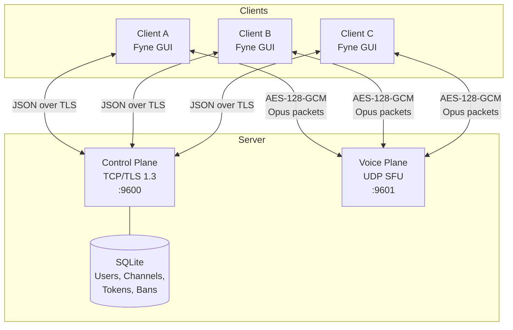
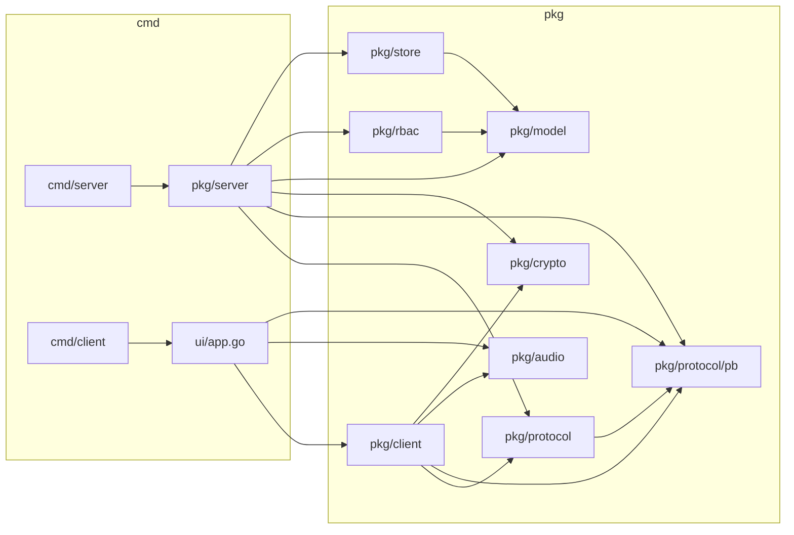
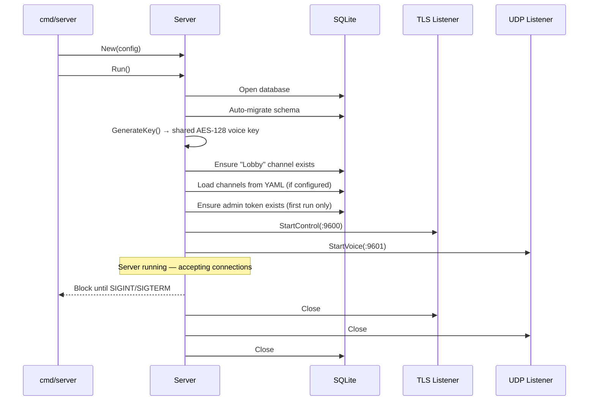
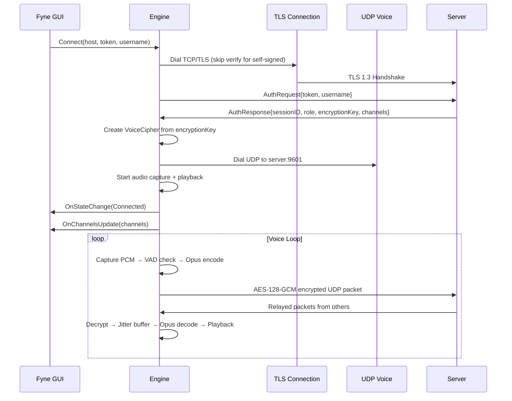
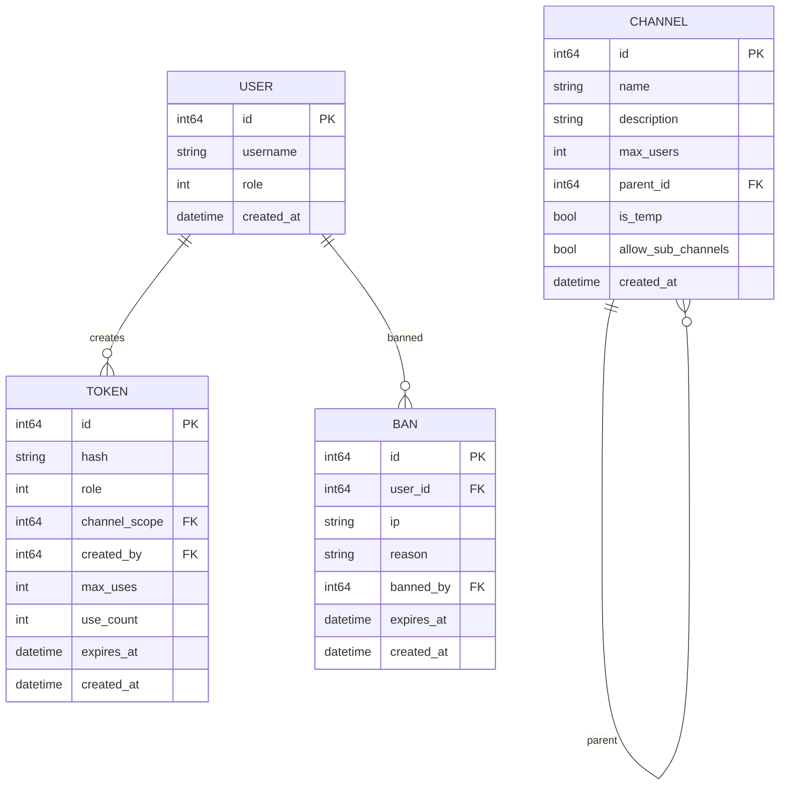

# GoSpeak Architecture

GoSpeak is a privacy-focused voice communication server and client built in Go. It follows a Selective Forwarding Unit (SFU) architecture — the server relays encrypted voice packets between clients without decoding them.

## High-Level Overview

## Package Structure

### Package Responsibilities

| Package | Description |
|---------|-------------|
| `cmd/server` | Server CLI entry point with flag parsing |
| `cmd/client` | Client entry point — launches the Fyne GUI |
| `pkg/server` | Server core: TLS listener, control handler, voice SFU, channel/session management, YAML config |
| `pkg/client` | Client engine: connection management, voice pipeline, jitter buffer, bookmarks, settings, hotkeys |
| `pkg/protocol` | Length-prefixed JSON framing for the control plane |
| `pkg/protocol/pb` | All control message type definitions (structs with JSON tags) |
| `pkg/audio` | PortAudio capture/playback, Opus encode/decode, VAD (Voice Activity Detection) |
| `pkg/crypto` | AES-128-GCM voice encryption, key generation, token hashing (SHA-256), password hashing (Argon2id) |
| `pkg/model` | Core domain types: User, Channel, Token, Ban, Session, Role, Permission |
| `pkg/rbac` | Role-based access control — permission matrix for User/Moderator/Admin |
| `pkg/store` | SQLite persistence with auto-migration |
| `ui` | Fyne v2 desktop GUI with channel tree, chat, settings, admin tools |

## Server Lifecycle

## Client Connection Flow

## Data Models

