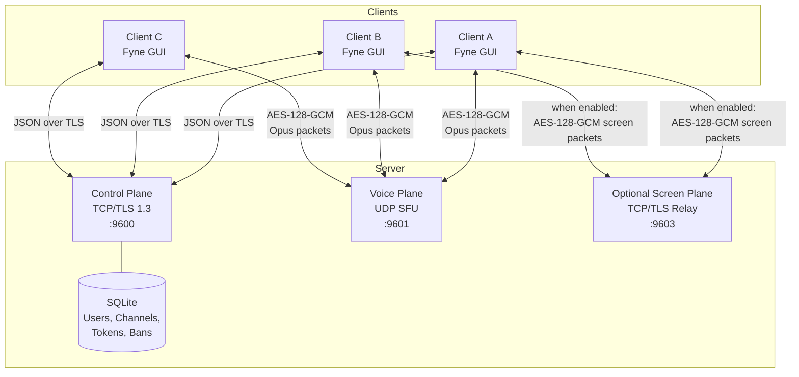
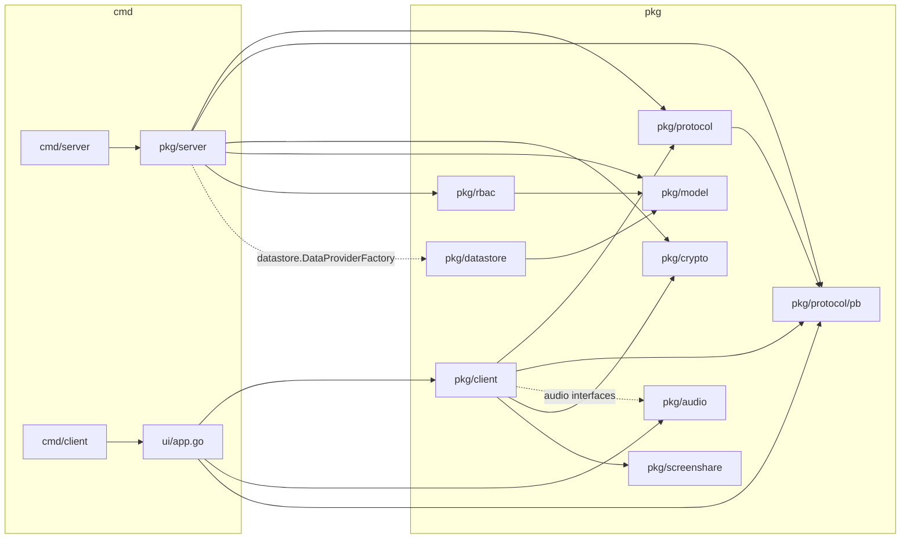
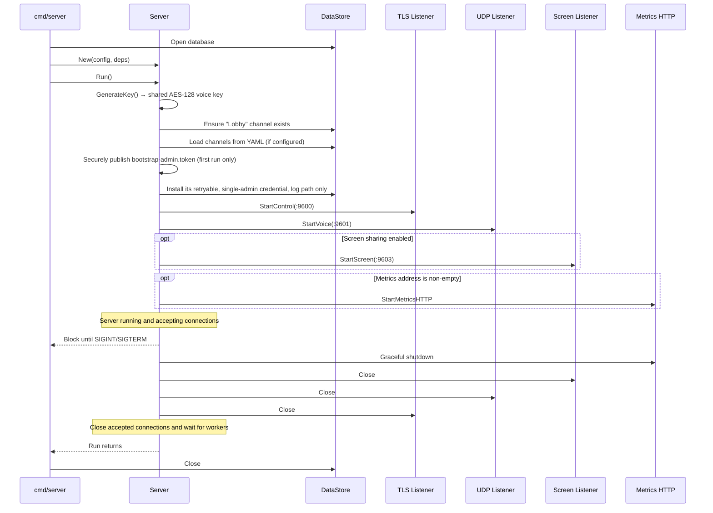
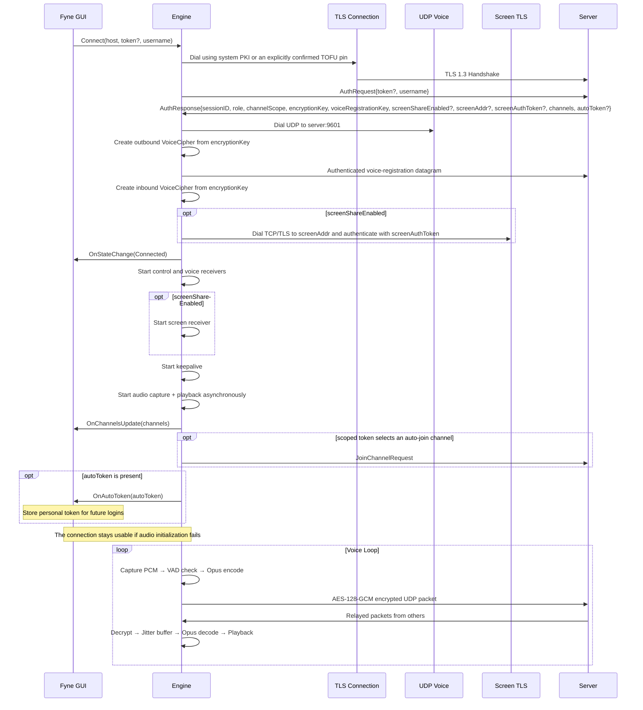
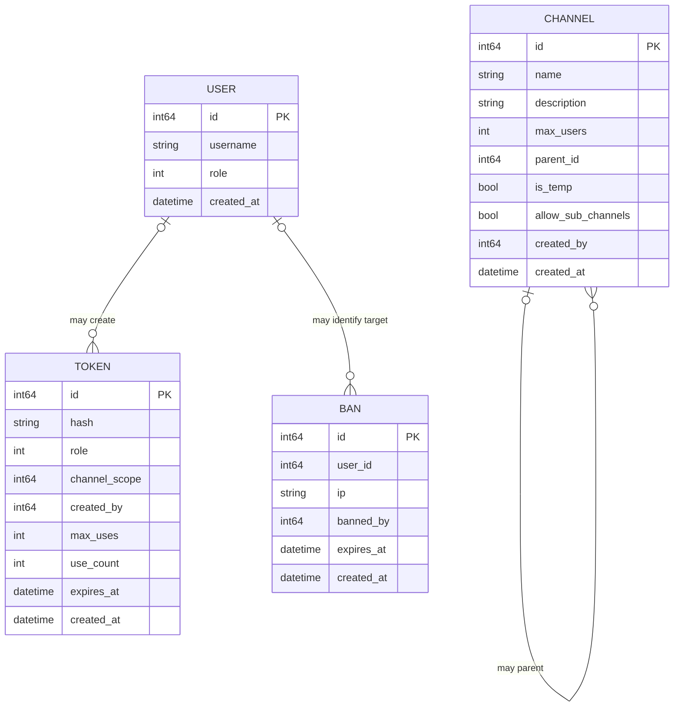

# GoSpeak Architecture

GoSpeak is a privacy-focused voice communication server and client built in Go. It uses a split transport architecture: a TLS control plane for signalling, a UDP SFU for voice, and a TLS relay plane for encrypted screen sharing.

## High-Level Overview

```mermaid
graph TB
    subgraph Clients
        C1[Client A<br/>Fyne GUI]
        C2[Client B<br/>Fyne GUI]
        C3[Client C<br/>Fyne GUI]
    end

    subgraph Server
        CTRL[Control Plane<br/>TCP/TLS 1.3<br/>:9600]
        SFU[Voice Plane<br/>UDP SFU<br/>:9601]
        SCR[Optional Screen Plane<br/>TCP/TLS Relay<br/>:9603]
        DB[(SQLite<br/>Users, Channels,<br/>Tokens, Bans)]
    end

    C1 <-->|JSON over TLS| CTRL
    C2 <-->|JSON over TLS| CTRL
    C3 <-->|JSON over TLS| CTRL

    C1 <-->|AES-128-GCM<br/>Opus packets| SFU
    C2 <-->|AES-128-GCM<br/>Opus packets| SFU
    C3 <-->|AES-128-GCM<br/>Opus packets| SFU

    C1 <-->|when enabled:<br/>AES-128-GCM screen packets| SCR
    C2 <-->|when enabled:<br/>AES-128-GCM screen packets| SCR

    CTRL --- DB
```

## Package Structure

```mermaid
graph LR
    subgraph cmd
        CS[cmd/server] --> SRV
        CC[cmd/client] --> UI
    end

    subgraph pkg
        SRV[pkg/server]
        CLT[pkg/client]
        PROTO[pkg/protocol]
        PB[pkg/protocol/pb]
        AUDIO[pkg/audio]
        CRYPTO[pkg/crypto]
        MODEL[pkg/model]
        RBAC[pkg/rbac]
        SCREEN[pkg/screenshare]
        STORE[pkg/datastore]
    end

    UI[ui/app.go]

    SRV --> PROTO
    SRV --> PB
    SRV --> CRYPTO
    SRV --> MODEL
    SRV --> RBAC
    SRV -.->|datastore.DataProviderFactory| STORE

    CLT --> PROTO
    CLT --> PB
    CLT -.->|audio interfaces| AUDIO
    CLT --> CRYPTO
    CLT --> SCREEN

    UI --> CLT
    UI --> AUDIO
    UI --> PB

    PROTO --> PB
    RBAC --> MODEL
    STORE --> MODEL
```

> **Dashed arrows** indicate dependencies on interfaces. See [Onion Architecture](#onion-architecture) below.

### Package Responsibilities

| Package | Description |
|---------|-------------|
| `cmd/server` | Server CLI entry point with flag parsing |
| `cmd/client` | Client entry point that launches the Fyne GUI |
| `pkg/server` | Server core: TLS listener, control handler, voice SFU, channel/session management, YAML config |
| `pkg/client` | Client engine: connection management, voice pipeline, jitter buffer, bookmarks, settings, hotkeys |
| `pkg/protocol` | Framing and packet formats for control, voice, and screen-share transports |
| `pkg/protocol/pb` | All control message type definitions (structs with JSON tags) |
| `pkg/audio` | Audio interfaces (`Capturer`, `Player`, `AudioEncoder`, `AudioDecoder`, `VoiceDetector`, `DecoderFactory`, `DeviceLister`) + PortAudio/Opus default implementations |
| `pkg/crypto` | AES-128-GCM voice encryption, key generation, token hashing (SHA-256), password hashing (Argon2id) |
| `pkg/screenshare` | Platform-specific screen capture and JPEG encoding helpers |
| `pkg/model` | Core domain types: User, Channel, Token, Ban, Session, Role, Permission |
| `pkg/rbac` | Role-based access control and the User/Moderator/Admin permission matrix |
| `pkg/datastore` | `DataProviderFactory` interface + SQLite implementation |
| `ui` | Fyne v2 desktop GUI with channel tree, chat, settings, admin tools |

## Onion Architecture

GoSpeak follows an **onion (hexagonal) architecture**: core business logic depends on interfaces. This allows swapping backends without touching the server or client logic.

The server receives its dependencies (notably `datastore.DataProviderFactory`) from `cmd/server` via `server.Dependencies`. This keeps `pkg/server` free of concrete implementations.

## Server Lifecycle

```mermaid
sequenceDiagram
    participant Main as cmd/server
    participant Srv as Server
    participant Store as DataStore
    participant TLS as TLS Listener
    participant UDP as UDP Listener
    participant SCR as Screen Listener
    participant MET as Metrics HTTP

    Main->>Store: Open database
    Main->>Srv: New(config, deps)
    Main->>Srv: Run()
    Srv->>Srv: GenerateKey() → shared AES-128 voice key
    Srv->>Store: Ensure "Lobby" channel exists
    Srv->>Store: Load channels from YAML (if configured)
    Srv->>Srv: Securely publish bootstrap-admin.token (first run only)
    Srv->>Store: Install its retryable, single-admin credential, log path only
    Srv->>TLS: StartControl(:9600)
    Srv->>UDP: StartVoice(:9601)
    opt Screen sharing enabled
        Srv->>SCR: StartScreen(:9603)
    end
    opt Metrics address is non-empty
        Srv->>MET: StartMetricsHTTP
    end
    Note over Srv: Server running and accepting connections
    Srv-->>Main: Block until SIGINT/SIGTERM
    Srv->>MET: Graceful shutdown
    Srv->>SCR: Close
    Srv->>UDP: Close
    Srv->>TLS: Close
    Note over Srv: Close accepted connections and wait for workers
    Srv-->>Main: Run returns
    Main->>Store: Close
```

## Client Connection Flow

```mermaid
sequenceDiagram
    participant UI as Fyne GUI
    participant Eng as Engine
    participant TLS as TLS Connection
    participant UDP as UDP Voice
    participant SCR as Screen TLS
    participant Srv as Server

    UI->>Eng: Connect(host, token?, username)
    Eng->>TLS: Dial using system PKI or an explicitly confirmed TOFU pin
    TLS->>Srv: TLS 1.3 Handshake
    Eng->>Srv: AuthRequest{token?, username}
    Srv->>Eng: AuthResponse{sessionID, role, channelScope, encryptionKey, voiceRegistrationKey, screenShareEnabled?, screenAddr?, screenAuthToken?, channels, autoToken?}
    Eng->>UDP: Dial UDP to server:9601
    Eng->>Eng: Create outbound VoiceCipher from encryptionKey
    Eng->>Srv: Authenticated voice-registration datagram
    Eng->>Eng: Create inbound VoiceCipher from encryptionKey
    opt screenShareEnabled
        Eng->>SCR: Dial TCP/TLS to screenAddr and authenticate with screenAuthToken
    end
    Eng->>UI: OnStateChange(Connected)
    Eng->>Eng: Start control and voice receivers
    opt screenShareEnabled
        Eng->>Eng: Start screen receiver
    end
    Eng->>Eng: Start keepalive
    Eng->>Eng: Start audio capture + playback asynchronously
    Eng->>UI: OnChannelsUpdate(channels)
    opt scoped token selects an auto-join channel
        Eng->>Srv: JoinChannelRequest
    end
    opt autoToken is present
        Eng->>UI: OnAutoToken(autoToken)
        Note over UI: Store personal token for future logins
    end
    Note over Eng,UI: The connection stays usable if audio initialization fails

    loop Voice Loop
        Eng->>Eng: Capture PCM → VAD check → Opus encode
        Eng->>Srv: AES-128-GCM encrypted UDP packet
        Srv->>Eng: Relayed packets from others
        Eng->>Eng: Decrypt → Jitter buffer → Opus decode → Playback
    end
```

## Data Models

```mermaid
erDiagram
    USER {
        int64 id PK
        string username
        int role
        datetime created_at
    }
    CHANNEL {
        int64 id PK
        string name
        string description
        int max_users
        int64 parent_id
        bool is_temp
        bool allow_sub_channels
        int64 created_by
        datetime created_at
    }
    TOKEN {
        int64 id PK
        string hash
        int role
        int64 channel_scope
        int64 created_by
        int max_uses
        int use_count
        datetime expires_at
        datetime created_at
    }
    BAN {
        int64 id PK
        int64 user_id
        string ip
        int64 banned_by
        datetime expires_at
        datetime created_at
    }

    USER |o--o{ TOKEN : "may create"
    USER |o--o{ BAN : "may identify target"
    CHANNEL |o--o{ CHANNEL : "may parent"
```

These are optional logical application relationships. Root channels, system-created
tokens and channels, and IP-only bans use zero-valued relationship IDs. The SQLite
schema stores these IDs as ordinary integer columns and does not declare foreign-key
constraints. Ban reasons are intentionally not persisted. The `ip` column is empty
for account bans and contains one canonical exact address only for an explicit
administrator-created IP ban.
