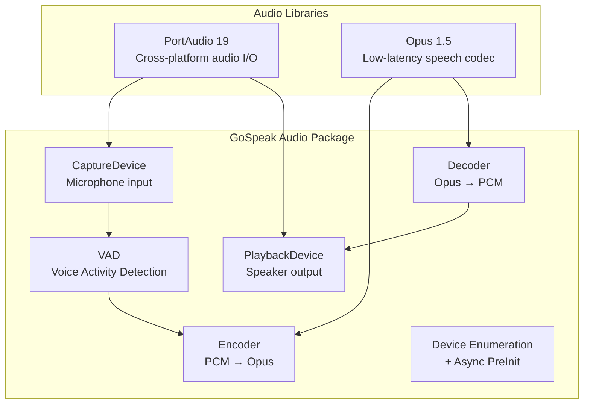
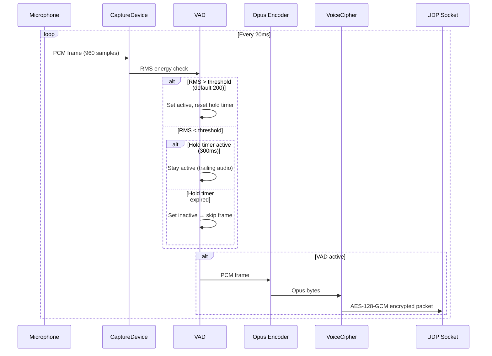
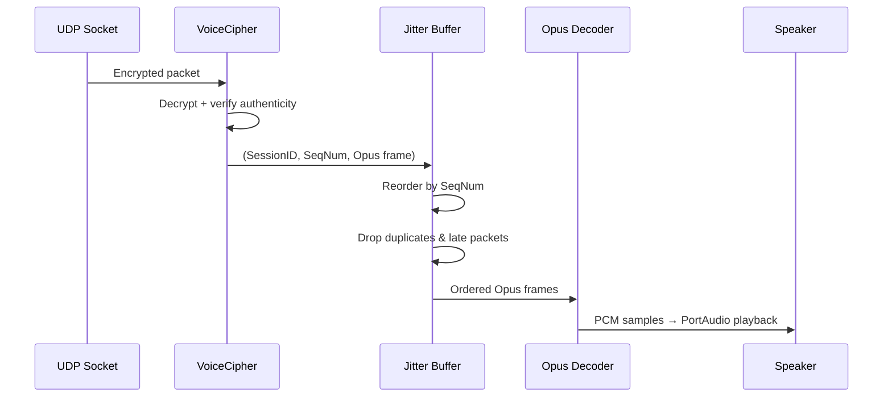
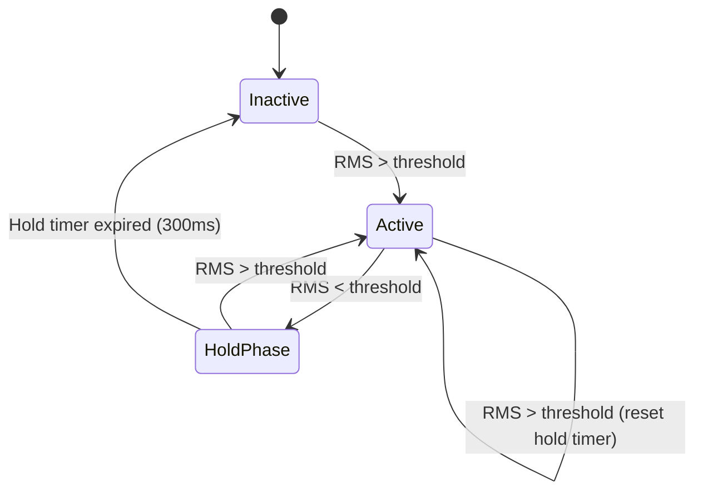
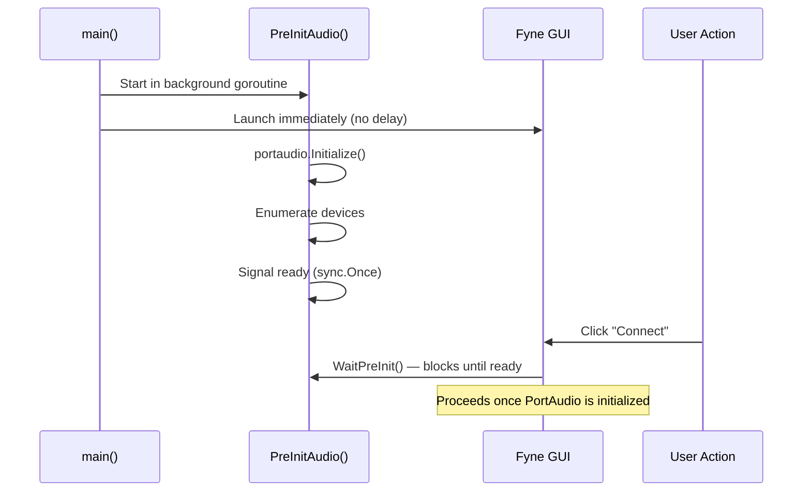
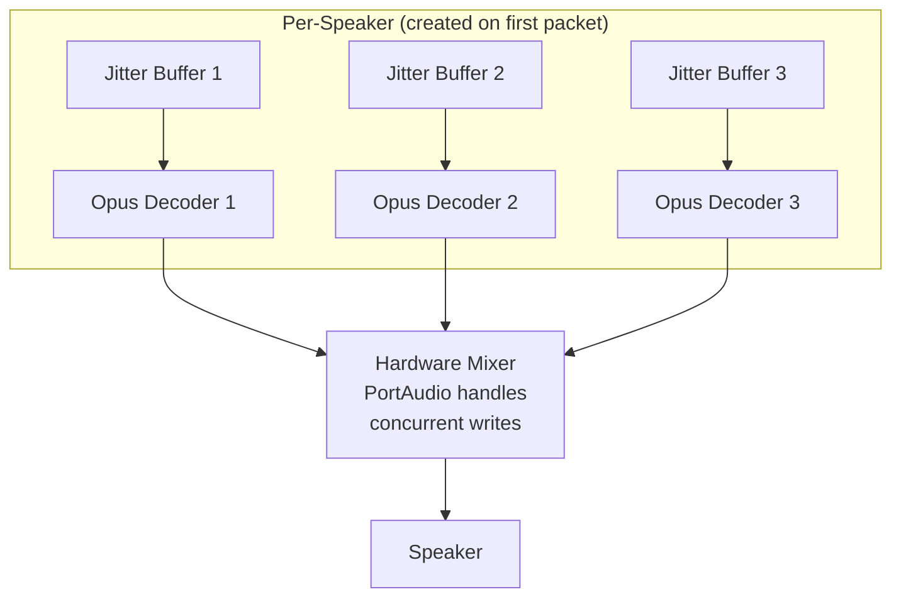

# GoSpeak Audio Pipeline

GoSpeak uses PortAudio for hardware I/O and Opus for codec, with a Voice Activity Detection (VAD) system to suppress silence.

## Audio Stack

## Audio Parameters

| Parameter | Value |
|-----------|-------|
| Sample Rate | 48,000 Hz |
| Channels | 1 (Mono) |
| Sample Format | 16-bit signed integer (int16) |
| Frame Duration | 20 ms |
| Frame Size | 960 samples |
| Opus Application | VoIP mode |
| Opus Bitrate | Auto |

## Capture → Transmit Pipeline

## Receive → Playback Pipeline

## Voice Activity Detection (VAD)

GoSpeak uses an energy-based VAD to avoid transmitting silence:

### VAD Parameters

| Parameter | Default | Description |
|-----------|---------|-------------|
| Threshold | 200 | RMS energy level to trigger voice detection |
| Hold Frames | 15 | Number of frames to keep transmitting after voice stops (15 × 20ms = 300ms) |
| Pre-buffer | 3 | Frames buffered before voice onset for smooth start (3 × 20ms = 60ms) |

The VAD threshold is user-configurable via the settings dialog and persisted in `settings.yaml`.

## Jitter Buffer

Each remote speaker gets a dedicated jitter buffer that:

1. **Reorders** packets by sequence number (handles out-of-order UDP delivery)
2. **Drops duplicates** (same SeqNum received twice)
3. **Drops late packets** (SeqNum too far behind the playback cursor)
4. **Provides smooth playback** by buffering a small number of frames

## PortAudio Initialization

PortAudio initialization is slow (~1-2 seconds, especially on Windows). GoSpeak uses **async pre-initialization** to avoid blocking the GUI:

## Device Selection

Users can select specific input/output audio devices via the settings dialog. Device names are matched against the PortAudio device list at connection time. If the configured device is not found, the system default is used.

## Multi-Speaker Mixing

Each remote speaker has an independent decode chain:

Decoder and jitter buffer instances are created lazily when the first packet from a new `SessionID` is received, and are cleaned up when the speaker disconnects.
