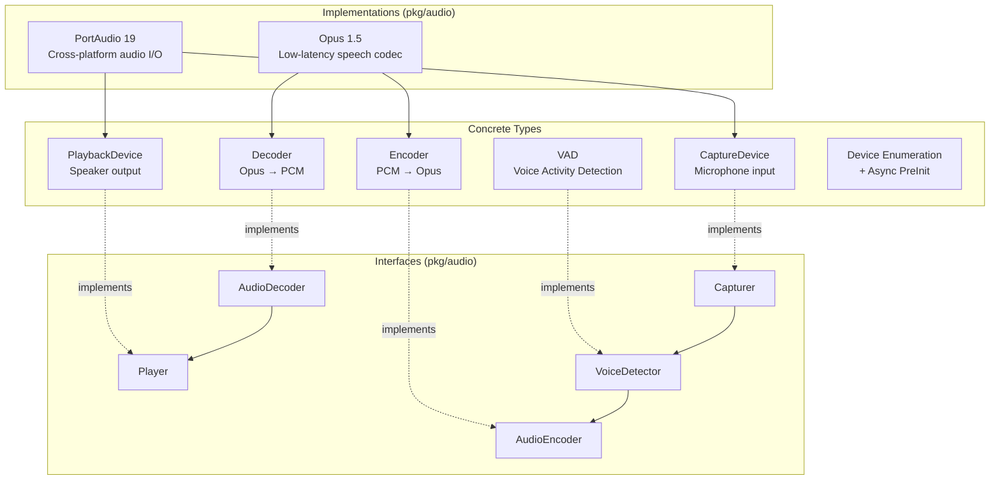
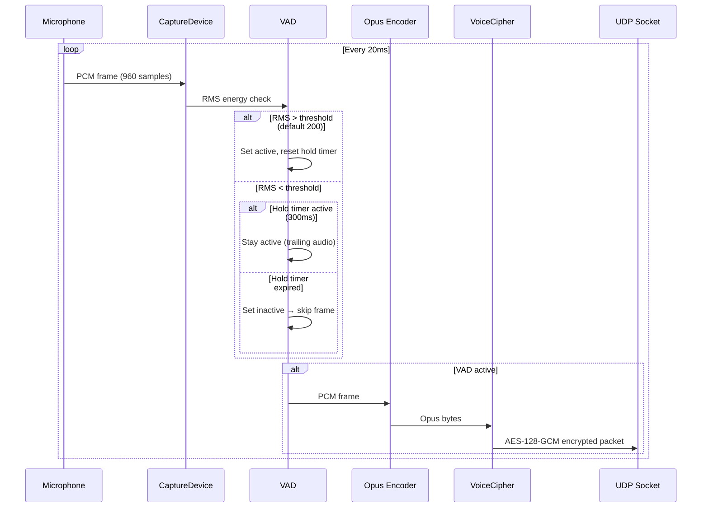
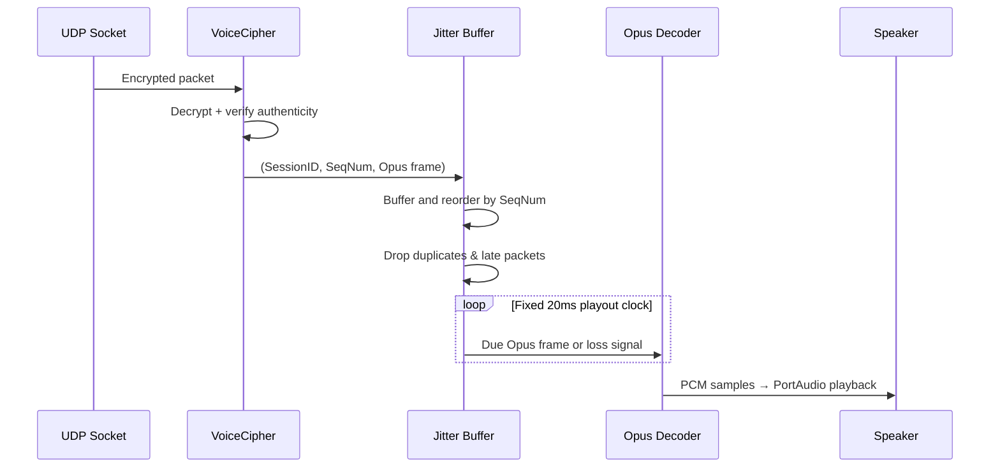
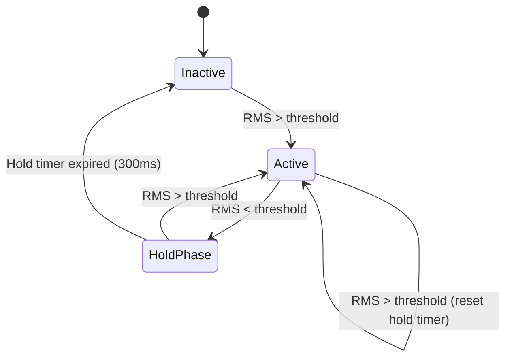
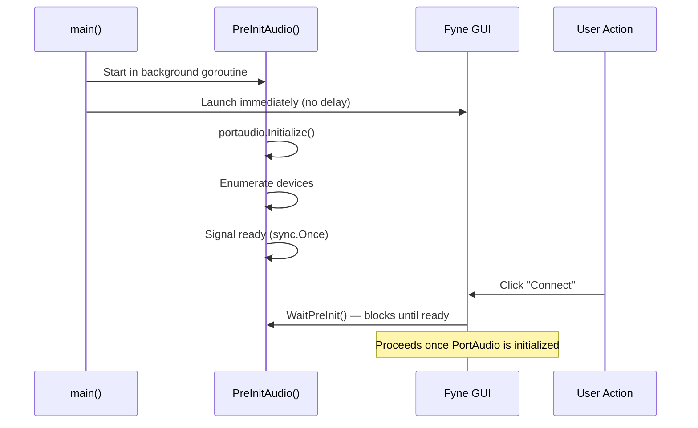
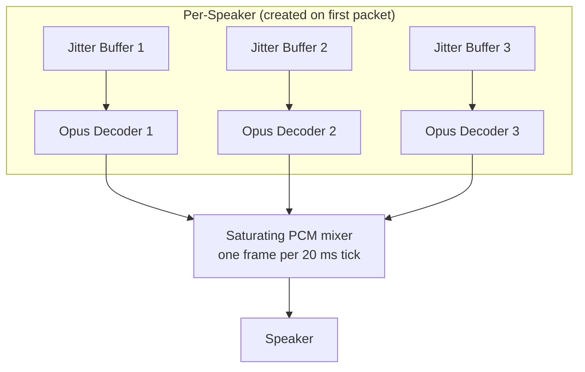

# GoSpeak Audio Pipeline

GoSpeak uses PortAudio for hardware I/O and Opus for codec, with a Voice Activity Detection (VAD) system to suppress silence.

The audio subsystem follows an **interface-based (onion) architecture**,  this allows swapping audio backends for different platforms (e.g., Android Oboe, iOS AVAudioEngine) without changing the client logic.

## Audio Interfaces

All audio interfaces are defined in [`pkg/audio/interface.go`](../pkg/audio/interface.go):

| Interface | Methods | Default Implementation |
|-----------|---------|------------------------|
| `Capturer` | `Start()`, `ReadFrame()`, `Stop()`, `Close()` | `CaptureDevice` (PortAudio) |
| `Player` | `Start()`, `WriteFrame()`, `Stop()` | `PlaybackDevice` (PortAudio) |
| `AudioEncoder` | `Encode(pcm) → bytes` | `Encoder` (Opus) |
| `AudioDecoder` | `Decode(bytes) → pcm`, `DecodePLC()` | `Decoder` (Opus) |
| `DecoderFactory` | `NewDecoder() → AudioDecoder` | `defaultDecoderFactory` |
| `VoiceDetector` | `Process()`, `IsActive()`, `PreBufferedFrames()`, `SetThreshold()` | `VAD` (energy-based) |
| `DeviceLister` | `ListInputDevices()`, `ListOutputDevices()` | Functions in `devices.go` |

Compile-time checks (`var _ Interface = (*Impl)(nil)`) ensure the default implementations satisfy their interfaces.

## Audio Stack

```mermaid
graph TB
    subgraph "Interfaces (pkg/audio)"
        ICAP[Capturer]
        IPB[Player]
        IENC[AudioEncoder]
        IDEC[AudioDecoder]
        IVAD[VoiceDetector]
    end

    subgraph "Implementations (pkg/audio)"
        PA[PortAudio 19<br/>Cross-platform audio I/O]
        OPUS[Opus 1.5<br/>Low-latency speech codec]
    end

    subgraph "Concrete Types"
        CAP[CaptureDevice<br/>Microphone input]
        PB[PlaybackDevice<br/>Speaker output]
        ENC[Encoder<br/>PCM → Opus]
        DEC[Decoder<br/>Opus → PCM]
        VAD[VAD<br/>Voice Activity Detection]
        DEV[Device Enumeration<br/>+ Async PreInit]
    end

    PA --> CAP
    PA --> PB
    OPUS --> ENC
    OPUS --> DEC

    CAP -.->|implements| ICAP
    PB -.->|implements| IPB
    ENC -.->|implements| IENC
    DEC -.->|implements| IDEC
    VAD -.->|implements| IVAD

    ICAP --> IVAD
    IVAD --> IENC
    IDEC --> IPB
```

## Audio Parameters

| Parameter | Value |
|-----------|-------|
| Sample Rate | 48,000 Hz |
| Channels | 1 (Mono) |
| Sample Format | 16-bit signed integer (int16) |
| Frame Duration | 20 ms |
| Frame Size | 960 samples |
| Opus Application | VoIP mode |
| Opus Bitrate | Auto |

## Capture → Transmit Pipeline

```mermaid
sequenceDiagram
    participant MIC as Microphone
    participant CAP as CaptureDevice
    participant VAD as VAD
    participant ENC as Opus Encoder
    participant CRY as VoiceCipher
    participant NET as UDP Socket

    loop Every 20ms
        MIC->>CAP: PCM frame (960 samples)
        CAP->>VAD: RMS energy check
        alt RMS > threshold (default 200)
            VAD->>VAD: Set active, reset hold timer
        else RMS < threshold
            alt Hold timer active (300ms)
                VAD->>VAD: Stay active (trailing audio)
            else Hold timer expired
                VAD->>VAD: Set inactive → skip frame
            end
        end
        alt VAD active
            VAD->>ENC: PCM frame
            ENC->>CRY: Opus bytes
            CRY->>NET: AES-128-GCM encrypted packet
        end
    end
```

## Receive → Playback Pipeline

```mermaid
sequenceDiagram
    participant NET as UDP Socket
    participant CRY as VoiceCipher
    participant JIT as Jitter Buffer
    participant DEC as Opus Decoder
    participant SPK as Speaker

    NET->>CRY: Encrypted packet
    CRY->>CRY: Decrypt + verify authenticity
    CRY->>JIT: (SessionID, SeqNum, Opus frame)
    JIT->>JIT: Buffer and reorder by SeqNum
    JIT->>JIT: Drop duplicates & late packets
    loop Fixed 20ms playout clock
        JIT->>DEC: Due Opus frame or loss signal
    end
    DEC->>SPK: PCM samples → PortAudio playback
```

## Voice Activity Detection (VAD)

GoSpeak uses an energy-based VAD to avoid transmitting silence:

```mermaid
stateDiagram-v2
    [*] --> Inactive
    Inactive --> Active: RMS > threshold
    Active --> Active: RMS > threshold (reset hold timer)
    Active --> HoldPhase: RMS < threshold
    HoldPhase --> Active: RMS > threshold
    HoldPhase --> Inactive: Hold timer expired (300ms)
```

### VAD Parameters

| Parameter | Default | Description |
|-----------|---------|-------------|
| Threshold | 200 | RMS energy level to trigger voice detection |
| Hold Frames | 15 | Number of frames to keep transmitting after voice stops (15 × 20ms = 300ms) |
| Pre-buffer | 3 | Frames buffered before voice onset for smooth start (3 × 20ms = 60ms) |

The VAD threshold is user-configurable via the settings dialog and persisted in `settings.yaml`.

## Jitter Buffer

Each remote speaker gets a dedicated jitter buffer that:

1. **Reorders** packets by sequence number (handles out-of-order UDP delivery)
2. **Drops duplicates** (same SeqNum received twice)
3. **Drops late packets** (SeqNum too far behind the playback cursor)
4. **Waits for a 20 ms playout window** before releasing the first frame, so
   ordinary UDP reordering does not immediately trigger packet-loss concealment
5. **Runs on a fixed 20 ms playout clock** and emits packet-loss concealment only
   after the missing frame's deadline has elapsed
6. **Stays bounded to 15 frames** and resynchronizes after larger sequence jumps
   instead of accumulating packets or producing a long PLC burst

Sequence comparisons use modular `uint32` ordering, including wrap from
`4294967295` to `0`. Duplicate and already-played packets are discarded. When a
speaker becomes idle, playout also becomes idle rather than generating PLC
forever; the next talk spurt starts a fresh jitter window.

## PortAudio Initialization

PortAudio initialization is slow (~1-2 seconds, especially on Windows). GoSpeak uses **async pre-initialization** to avoid blocking the GUI:

```mermaid
sequenceDiagram
    participant Main as main()
    participant Pre as PreInitAudio()
    participant GUI as Fyne GUI
    participant User as User Action

    Main->>Pre: Start in background goroutine
    Main->>GUI: Launch immediately (no delay)
    Pre->>Pre: portaudio.Initialize()
    Pre->>Pre: Enumerate devices
    Pre->>Pre: Signal ready (sync.Once)
    User->>GUI: Click "Connect"
    GUI->>Pre: WaitPreInit() — blocks until ready
    Note over GUI: Proceeds once PortAudio is initialized
```

## Device Selection

Users can select specific input/output audio devices via the settings dialog. Device names are matched against the PortAudio device list at connection time. If the configured device is not found, the system default is used.

## Multi-Speaker Mixing

Each remote speaker has an independent decode chain:

```mermaid
graph TB
    subgraph "Per-Speaker (created on first packet)"
        JB1[Jitter Buffer 1] --> D1[Opus Decoder 1]
        JB2[Jitter Buffer 2] --> D2[Opus Decoder 2]
        JB3[Jitter Buffer 3] --> D3[Opus Decoder 3]
    end

    D1 --> MIX[Saturating PCM mixer<br/>one frame per 20 ms tick]
    D2 --> MIX
    D3 --> MIX
    MIX --> SPK[Speaker]
```

On every 20 ms playout tick, at most one due frame is decoded per active
speaker. Those PCM frames are summed with `int16` saturation and sent to
PortAudio as exactly one frame, so concurrent speakers do not multiply the
playout duration. A speaker without a due frame contributes silence. Decoder
and jitter-buffer state is created lazily and removed after 30 seconds without
a packet.
