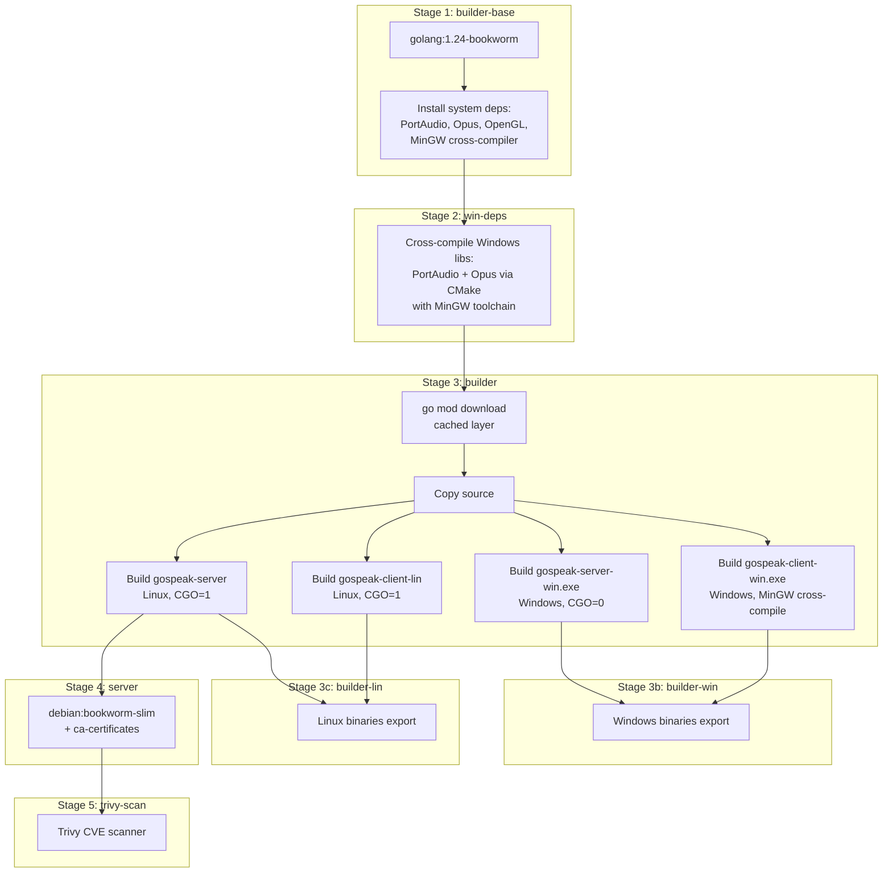

# Building GoSpeak

GoSpeak uses multi-stage container builds to compile all binaries. This ensures reproducible builds with all native dependencies (PortAudio, Opus, OpenGL) handled inside the container.

## Prerequisites

- **Podman** (or Docker) — for container builds
- **Go 1.24+** — only needed for local development without containers

## Quick Build

### Using Docker Compose

```bash
# Build and run the server
docker compose up --build

# Or with Podman Compose
podman-compose up --build

# Extract all 4 binaries to ./bin/
docker compose --profile build run --build builder

# Windows binaries only → ./bin/
docker compose --profile build-win run --build builder-win

# Linux binaries only → ./bin/
docker compose --profile build-lin run --build builder-lin

# Run golangci-lint
docker compose --profile dev run --build lint
```

## Build Outputs

| Binary | OS | Description |
|--------|----|-------------|
| `gospeak-server` | Linux | Server binary (CGO, uses SQLite via modernc.org) |
| `gospeak-server-win.exe` | Windows | Server binary (pure Go, CGO_ENABLED=0) |
| `gospeak-client-lin` | Linux | Client with Fyne GUI, PortAudio, Opus |
| `gospeak-client-win.exe` | Windows | Client cross-compiled with MinGW |

## Container Build Stages



### Layer Caching Strategy

The Containerfile is optimized for caching:

1. **System deps** (Stage 1) — cached until apt packages change
2. **Windows libs** (Stage 2) — cached until CMake config changes
3. **Go modules** (Stage 3, first step) — cached until go.mod/go.sum change
4. **Source compilation** (Stage 3, last step) — only this reruns on code changes

## Server Container

```bash
# Run standalone server
docker run -p 9600:9600 -p 9601:9601/udp \
  -v gospeak-data:/data \
  gospeak-server

# The server stores its database and TLS certs in /data
```

### Server Flags

| Flag | Default | Description |
|------|---------|-------------|
| `-addr` | `:9600` | TCP/TLS bind address |
| `-voice` | `:9601` | UDP voice bind address |
| `-db` | `gospeak.db` | SQLite database path |
| `-data` | `.` | Directory for auto-generated TLS certs |
| `-cert` | *(auto)* | Custom TLS certificate path |
| `-key` | *(auto)* | Custom TLS private key path |
| `-open` | `false` | Allow first-time connections without an invite token (personal token still required on reconnect) |
| `-channels-file` | *(none)* | YAML file defining channels to create on startup |
| `-metrics` | `:9602` | HTTP bind address for Prometheus /metrics (empty to disable) |
| `-export-users` | `false` | Export all users as YAML and exit |
| `-export-channels` | `false` | Export all channels as YAML and exit |

## Local Development (Without Containers)

For local development, you need the native dependencies installed:

### Linux (Debian/Ubuntu)

```bash
sudo apt install portaudio19-dev libopus-dev libgl1-mesa-dev \
  libx11-dev libxcursor-dev libxrandr-dev libxinerama-dev \
  libxi-dev libxxf86vm-dev

go build -tags nolibopusfile ./cmd/server/
go build -tags nolibopusfile ./cmd/client/
```

### Windows

Use the container build to cross-compile, or install PortAudio and Opus via MSYS2:

```bash
pacman -S mingw-w64-x86_64-portaudio mingw-w64-x86_64-opus
```

### macOS

```bash
brew install portaudio opus
go build -tags nolibopusfile ./cmd/server/
go build -tags nolibopusfile ./cmd/client/
```
