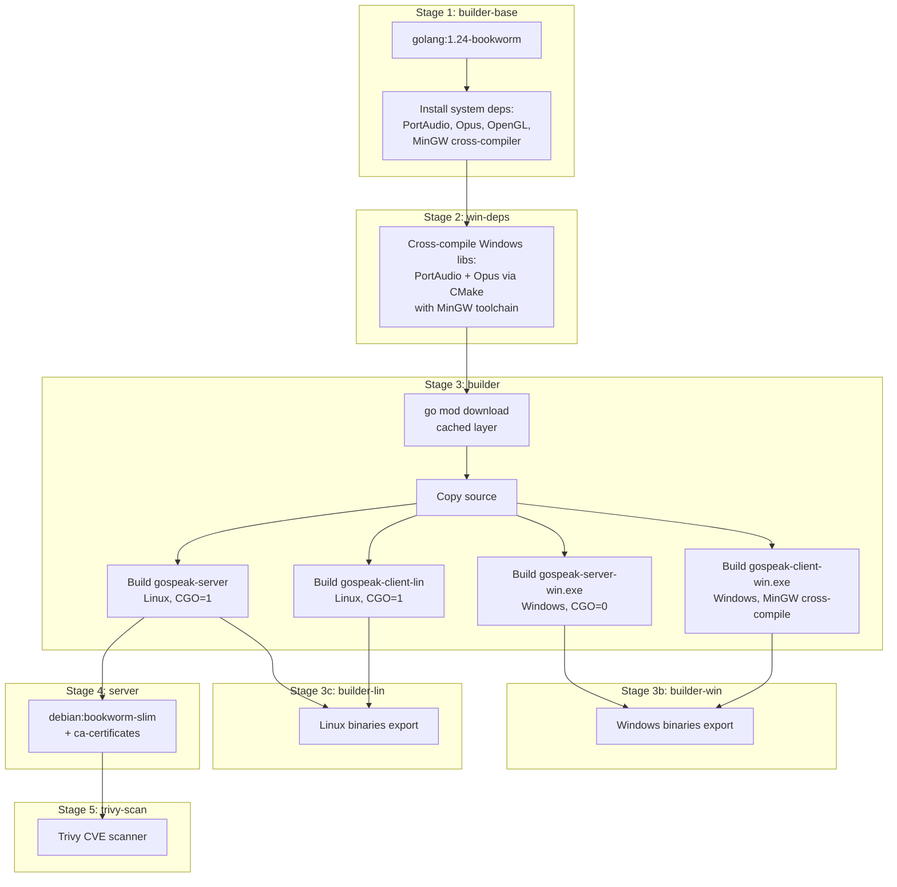

# Building GoSpeak

GoSpeak uses multi-stage container builds to compile all binaries and provide a
consistent build environment for native dependencies such as PortAudio, Opus,
and OpenGL. The current images and package inputs are not fully pinned, so these
builds are not bit-for-bit reproducible.

## Prerequisites

- **Podman** (or Docker) is used for container builds.
- **Go 1.24.4 or newer** is only needed for local development without containers.

## Quick Build

### Using Docker Compose

```bash
# Build and run the server
docker compose up --build

# Or with Podman Compose
podman-compose up --build

# Extract all 4 binaries to ./bin/
docker compose --profile build run --build builder

# Windows binaries only → ./bin/
docker compose --profile build-win run --build builder-win

# Linux binaries only → ./bin/
docker compose --profile build-lin run --build builder-lin

# Run golangci-lint
docker compose --profile dev run --build lint
```

## Build Outputs

| Binary | OS | Description |
|--------|----|-------------|
| `gospeak-server` | Linux | Server binary (CGO, uses SQLite via modernc.org) |
| `gospeak-server-win.exe` | Windows | Server binary (pure Go, CGO_ENABLED=0) |
| `gospeak-client-lin` | Linux | Client with Fyne GUI, PortAudio, Opus |
| `gospeak-client-win.exe` | Windows | Client cross-compiled with MinGW |

## Container Build Stages


```mermaid
graph TB
    subgraph "Stage 1: builder-base"
        S1[golang:1.24-bookworm]
        S1 --> DEPS[Install system deps:<br/>PortAudio, Opus, OpenGL,<br/>MinGW cross-compiler]
    end

    subgraph "Stage 2: win-deps"
        DEPS --> CMAKE[Cross-compile Windows libs:<br/>PortAudio + Opus via CMake<br/>with MinGW toolchain]
    end

    subgraph "Stage 3: builder"
        CMAKE --> GOMOD[go mod download<br/>cached layer]
        GOMOD --> COPY[Copy source]
        COPY --> SRV_LIN[Build gospeak-server<br/>Linux, CGO=1]
        COPY --> SRV_WIN[Build gospeak-server-win.exe<br/>Windows, CGO=0]
        COPY --> CLI_LIN[Build gospeak-client-lin<br/>Linux, CGO=1]
        COPY --> CLI_WIN[Build gospeak-client-win.exe<br/>Windows, MinGW cross-compile]
    end

    subgraph "Stage 3b: builder-win"
        SRV_WIN --> RT_WIN[Windows binaries export]
        CLI_WIN --> RT_WIN
    end

    subgraph "Stage 3c: builder-lin"
        SRV_LIN --> RT_LIN[Linux binaries export]
        CLI_LIN --> RT_LIN
    end

    subgraph "Stage 4: server"
        SRV_LIN --> RT1[debian:bookworm-slim<br/>+ ca-certificates]
    end

    subgraph "Stage 5: trivy-scan"
        RT1 --> TRIVY[Trivy CVE scanner]
    end
```

### Layer Caching Strategy

The Containerfile is optimized for caching:

1. **System deps** (Stage 1) stay cached until the apt packages change.
2. **Windows libs** (Stage 2) stay cached until the CMake config changes.
3. **Go modules** (the first step in Stage 3) stay cached until `go.mod` or `go.sum` changes.
4. **Source compilation** (the last step in Stage 3) is the only stage rerun for code changes.

## Server Container

```bash
# Run standalone server
docker run -p 9600:9600 -p 9601:9601/udp \
  -v gospeak-data:/data \
  gospeak-server

# The server stores its database and TLS certs in /data
```

### Server Flags

| Flag | Default | Description |
|------|---------|-------------|
| `-control` | `:9600` | TCP/TLS control plane bind address |
| `-voice` | `:9601` | UDP voice bind address |
| `-db` | `gospeak.db` | SQLite database path |
| `-data` | `.` | Directory for automatic TLS and bootstrap credential files; `-db` controls the database separately |
| `-cert` | *(empty)* | Custom TLS certificate, including self-signed; requires `-key` |
| `-key` | *(empty)* | Matching private key; requires `-cert`. Empty pair enables automatic self-signed mode in `-data`; the first new TLS connection within 30 days of expiry renews the certificate without rotating the key |
| `-open` | `false` | Allow first-time connections without an invite token (personal token still required on reconnect) |
| `-screen` | `:9603` | TCP/TLS screen-share relay bind address |
| `-screen-share` | `false` | Enable per-channel screen sharing |
| `-channels-file` | *(none)* | YAML file defining channels to create on startup |
| `-metrics` | *(empty)* | HTTP bind address for Prometheus `/metrics` and `/healthz`; disabled by default |
| `-max-sessions` | `1024` | Maximum concurrent authenticated sessions; non-positive values use the default |
| `-max-sessions-per-user` | `8` | Maximum concurrent sessions for one account; non-positive values use the default |
| `-control-message-burst` | `60` | Per-session and aggregate per-user control-message cost burst; non-positive values use the default and values below 5 are raised to 5 |
| `-control-messages-per-second` | `20` | Per-session and aggregate per-user control-message cost replenished each second; non-positive values use the default |
| `-control-global-burst` | `300` | Server-wide control-message cost burst; non-positive values use the default and values below 5 are raised to 5 |
| `-control-global-messages-per-second` | `100` | Server-wide control-message cost replenished each second; non-positive values use the default |
| `-export-users` | `false` | Export all users as YAML and exit |
| `-export-channels` | `false` | Export all channels as YAML and exit |

## Local Development (Without Containers)

For local development, you need the native dependencies installed:

### Linux (Debian/Ubuntu)

```bash
sudo apt install build-essential pkg-config \
  portaudio19-dev libopus-dev libgl1-mesa-dev \
  libx11-dev libxcursor-dev libxrandr-dev libxinerama-dev \
  libxi-dev libxxf86vm-dev

go build -tags nolibopusfile ./cmd/server/
go build -tags nolibopusfile ./cmd/client/
```

### Windows

Use the container build to cross-compile, or open an MSYS2 MinGW 64-bit shell,
put Go on `PATH`, and install PortAudio and Opus:

```bash
pacman -S --needed mingw-w64-x86_64-toolchain mingw-w64-x86_64-pkgconf \
  mingw-w64-x86_64-portaudio mingw-w64-x86_64-opus

export CGO_ENABLED=1
export CC=gcc
export PKG_CONFIG_PATH=/mingw64/lib/pkgconfig
go build -tags nolibopusfile ./cmd/server/
go build -tags nolibopusfile ./cmd/client/
```

### macOS

Install the Xcode Command Line Tools first so a C compiler is available, then:

```bash
brew install pkg-config portaudio opus
go build -tags nolibopusfile ./cmd/server/
go build -tags nolibopusfile ./cmd/client/
```
