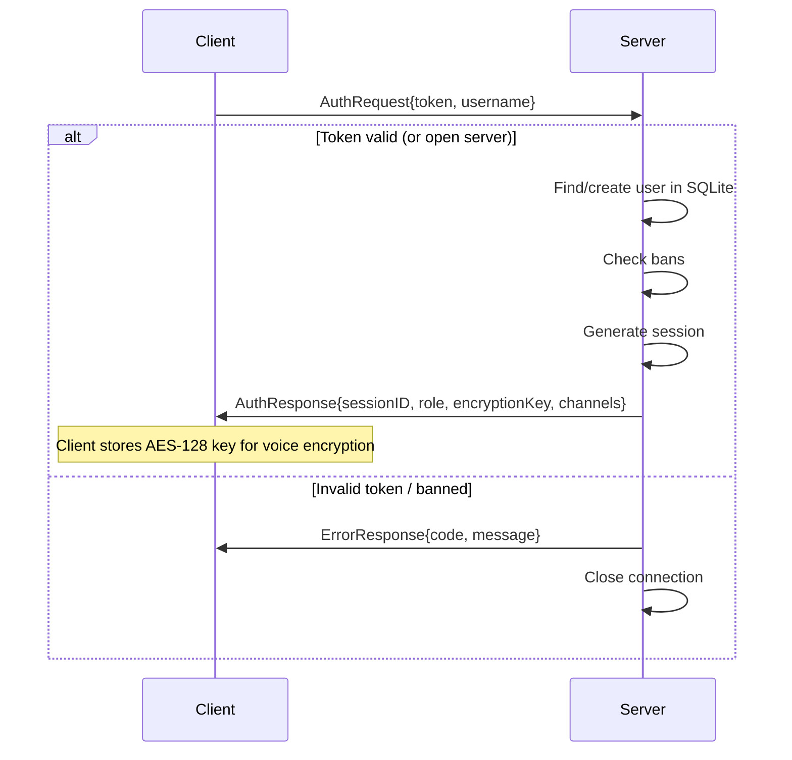
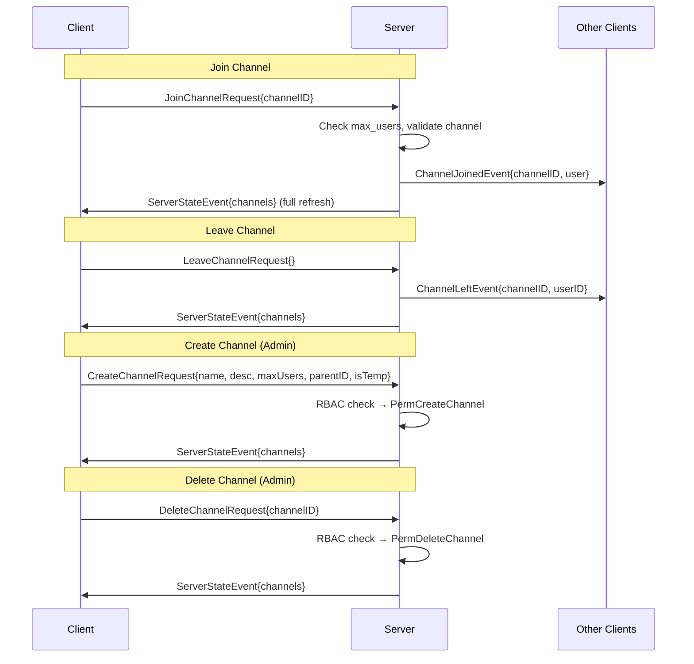
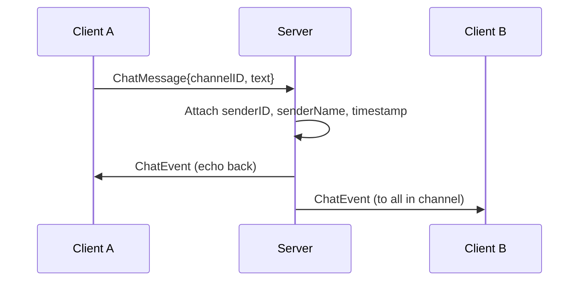
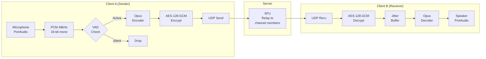

# GoSpeak Protocol

GoSpeak uses two transport layers: a **TCP/TLS 1.3 control plane** for signalling and a **UDP voice plane** for real-time audio.

## Control Plane (TCP/TLS)

- **Port**: 9600 (default)
- **Transport**: TCP with TLS 1.3 (self-signed certificates auto-generated on first run)
- **Framing**: Length-prefixed JSON — each message is preceded by a 4-byte big-endian uint32 length header
- **Serialization**: JSON with `omitempty` — only the populated field in `ControlMessage` is serialized

### Message Envelope
Every control message is a `ControlMessage` struct with exactly one field set:

- `AuthRequest`
- `AuthResponse`
- `ChannelListRequest`
- `ChannelListResponse`
- `JoinChannelRequest`
- `LeaveChannelRequest`
- `ChannelJoinedEvent`
- `ChannelLeftEvent`
- `UserStateUpdate`
- `ServerStateEvent`
- `CreateChannelRequest`
- `DeleteChannelRequest`
- `CreateTokenRequest`
- `CreateTokenResponse`
- `KickUserRequest`
- `BanUserRequest`
- `ChatMessage`
- `SetUserRoleRequest`
- `ExportDataRequest`
- `ImportChannelsRequest`
- `ErrorResponse`
- `Ping` / `Pong`

### Wire Format

```
┌──────────────────────────────────────────┐
│  4 bytes: message length (big-endian)    │
├──────────────────────────────────────────┤
│  N bytes: JSON-encoded ControlMessage    │
└──────────────────────────────────────────┘
```

### Authentication Flow



### Channel Operations



### Chat



### Admin Operations

| Message | Direction | Description |
|---------|-----------|-------------|
| `CreateTokenRequest` | Client → Server | Generate invite token with role, scope, max uses, expiry |
| `CreateTokenResponse` | Server → Client | Returns raw token string |
| `KickUserRequest` | Client → Server | Kick user by ID with reason |
| `BanUserRequest` | Client → Server | Ban user with optional duration |
| `SetUserRoleRequest` | Client → Server | Promote/demote user (admin only) |
| `SetUserRoleResponse` | Server → Client | Success/failure message |
| `ExportDataRequest` | Client → Server | Export channels or users as YAML |
| `ExportDataResponse` | Server → Client | YAML string data |
| `ImportChannelsRequest` | Client → Server | Import channels from YAML |
| `ImportChannelsResponse` | Server → Client | Success/failure message |

---

## Voice Plane (UDP)

- **Port**: 9601 (default)
- **Transport**: Raw UDP
- **Encryption**: AES-128-GCM (shared key distributed in `AuthResponse`)
- **Codec**: Opus at 48 kHz mono, 20ms frames (960 samples)

### Packet Format

```
┌─────────────────────────────────────────────────────────┐
│  Header (8 bytes, sent as plaintext additional data)    │
│  ┌─────────────────┬───────────────────┐                │
│  │ SessionID (4B)  │ SeqNum (4B)       │                │
│  └─────────────────┴───────────────────┘                │
├─────────────────────────────────────────────────────────┤
│  Payload: AES-128-GCM(opus_frame)                       │
│  ┌──────────────────────────────────────────────┐       │
│  │ Ciphertext (variable) + Auth Tag (16 bytes)  │       │
│  └──────────────────────────────────────────────┘       │
└─────────────────────────────────────────────────────────┘
```

### Voice Pipeline



### SFU Relay Logic

The server does **not** decode voice packets. It:

1. Receives a UDP packet from a client
2. Reads the 8-byte header to identify the sender's `SessionID`
3. Looks up which channel the sender is in
4. Forwards the packet **as-is** to all other members of that channel
5. Skips the sender (no echo) and any deafened users

### Nonce Construction

The AES-128-GCM nonce (12 bytes) is deterministic and never reused:

```
Nonce = [SessionID (4B)] [SeqNum (4B)] [0x00 0x00 0x00 0x00 (4B)]
```

- `SessionID` is unique per connection (assigned by server)
- `SeqNum` is a monotonically increasing `uint32` per sender (~994 days at 50 packets/sec before wrap)
