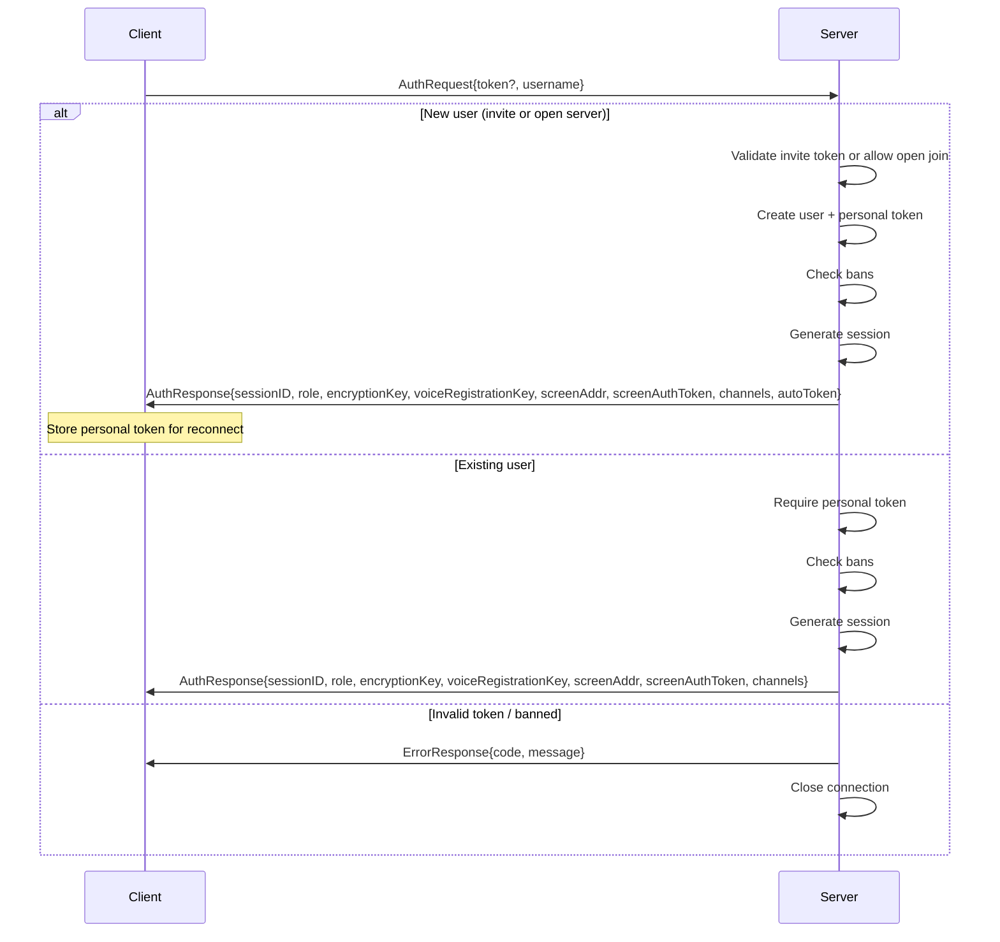
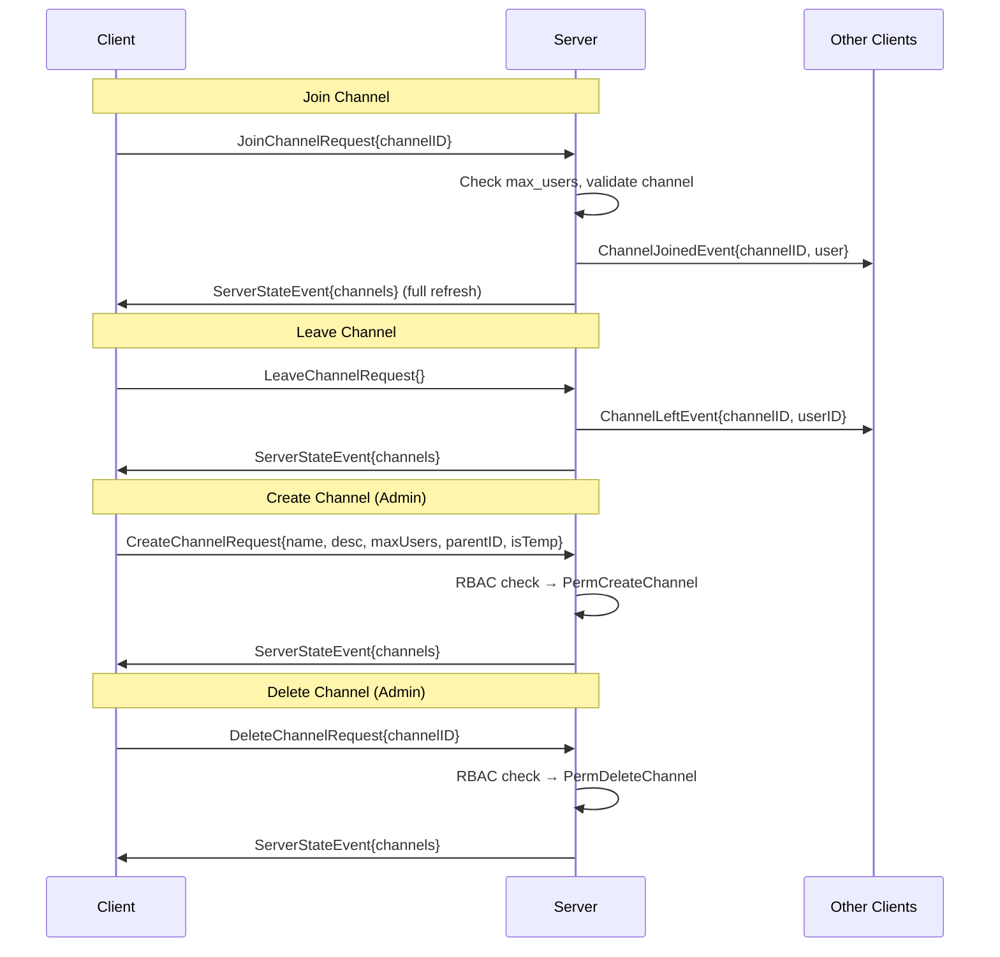
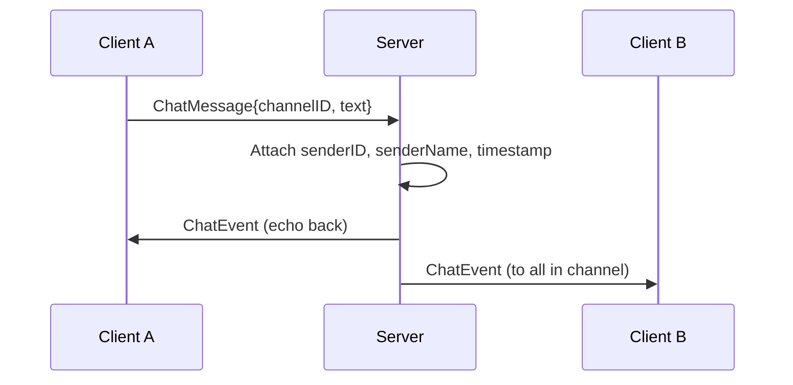
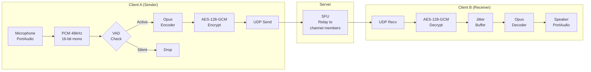

# GoSpeak Protocol

GoSpeak uses three transport layers: a **TCP/TLS 1.3 control plane** for signalling, a **UDP voice plane** for real-time audio, and a **TCP/TLS screen plane** for low-rate screen-share media.

## Control Plane (TCP/TLS)

- **Port**: 9600 (default)
- **Transport**: TCP with TLS 1.3 (self-signed certificates auto-generated on first run)
- **Framing**: Length-prefixed JSON — each message is preceded by a 4-byte big-endian uint32 length header
- **Serialization**: JSON with `omitempty` — only the populated field in `ControlMessage` is serialized

### Message Envelope
Every control message is a `ControlMessage` struct with exactly one field set:

- `AuthRequest`
- `AuthResponse`
- `ChannelListRequest`
- `ChannelListResponse`
- `JoinChannelRequest`
- `LeaveChannelRequest`
- `ChannelJoinedEvent`
- `ChannelLeftEvent`
- `UserStateUpdate`
- `ServerStateEvent`
- `CreateChannelRequest`
- `DeleteChannelRequest`
- `CreateTokenRequest`
- `CreateTokenResponse`
- `KickUserRequest`
- `BanUserRequest`
- `ChatMessage`
- `ScreenShareStartRequest`
- `ScreenShareStopRequest`
- `ScreenShareSubscribeRequest`
- `ScreenShareUnsubscribeRequest`
- `ScreenShareEvent`
- `SetUserRoleRequest`
- `ExportDataRequest`
- `ImportChannelsRequest`
- `ErrorResponse`
- `Ping` / `Pong`

### Wire Format

```
┌──────────────────────────────────────────┐
│  4 bytes: message length (big-endian)    │
├──────────────────────────────────────────┤
│  N bytes: JSON-encoded ControlMessage    │
└──────────────────────────────────────────┘
```

### Authentication Flow


```mermaid
sequenceDiagram
    participant C as Client
    participant S as Server

    C->>S: AuthRequest{token?, username}
    alt New user (invite or open server)
        S->>S: Validate invite token or allow open join
        S->>S: Create user + personal token
        S->>S: Check bans
        S->>S: Generate session
        S->>C: AuthResponse{sessionID, role, encryptionKey, voiceRegistrationKey, screenAddr, screenAuthToken, channels, autoToken}
        Note over C: Store personal token for reconnect
    else Existing user
        S->>S: Require personal token
        S->>S: Check bans
        S->>S: Generate session
        S->>C: AuthResponse{sessionID, role, encryptionKey, voiceRegistrationKey, screenAddr, screenAuthToken, channels}
    else Invalid token / banned
        S->>C: ErrorResponse{code, message}
        S->>S: Close connection
    end
```

### Channel Operations


```mermaid
sequenceDiagram
    participant C as Client
    participant S as Server
    participant Others as Other Clients

    Note over C,S: Join Channel
    C->>S: JoinChannelRequest{channelID}
    S->>S: Check max_users, validate channel
    S->>Others: ChannelJoinedEvent{channelID, user}
    S->>C: ServerStateEvent{channels} (full refresh)

    Note over C,S: Leave Channel
    C->>S: LeaveChannelRequest{}
    S->>Others: ChannelLeftEvent{channelID, userID}
    S->>C: ServerStateEvent{channels}

    Note over C,S: Create Channel (Admin)
    C->>S: CreateChannelRequest{name, desc, maxUsers, parentID, isTemp}
    S->>S: RBAC check → PermCreateChannel
    S->>C: ServerStateEvent{channels}

    Note over C,S: Delete Channel (Admin)
    C->>S: DeleteChannelRequest{channelID}
    S->>S: RBAC check → PermDeleteChannel
    S->>C: ServerStateEvent{channels}
```

### Chat


```mermaid
sequenceDiagram
    participant A as Client A
    participant S as Server
    participant B as Client B

    A->>S: ChatMessage{channelID, text}
    S->>S: Attach senderID, senderName, timestamp
    S->>A: ChatEvent (echo back)
    S->>B: ChatEvent (to all in channel)
```

### Screen Sharing Signalling

The control plane carries screen-share lifecycle messages only:

- `ScreenShareStartRequest`
- `ScreenShareStopRequest`
- `ScreenShareSubscribeRequest`
- `ScreenShareShareRequest`
- `ScreenShareUnsubscribeRequest`
- `ScreenShareEvent`

`ScreenShareEvent` is broadcast to channel members for presence updates. A targeted copy with an `encryption_key` is sent to the active sharer, to users already in the channel when sharing starts, and to current channel members if the sharer later shares the active key with the channel again.

### Admin Operations

| Message | Direction | Description |
|---------|-----------|-------------|
| `CreateTokenRequest` | Client → Server | Generate invite token with role, scope, max uses, expiry |
| `CreateTokenResponse` | Server → Client | Returns raw token string |
| `KickUserRequest` | Client → Server | Kick user by ID with reason |
| `BanUserRequest` | Client → Server | Ban user with optional duration |
| `SetUserRoleRequest` | Client → Server | Promote/demote user (admin only) |
| `SetUserRoleResponse` | Server → Client | Success/failure message |
| `ExportDataRequest` | Client → Server | Export channels or users as YAML |
| `ExportDataResponse` | Server → Client | YAML string data |
| `ImportChannelsRequest` | Client → Server | Import channels from YAML |
| `ImportChannelsResponse` | Server → Client | Success/failure message |

---

## Voice Plane (UDP)

- **Port**: 9601 (default)
- **Transport**: Raw UDP
- **Encryption**: AES-128-GCM (shared key distributed in `AuthResponse`)
- **Codec**: Opus at 48 kHz mono, 20ms frames (960 samples)

### Authenticated Endpoint Registration

A voice endpoint is not learned from an ordinary voice packet. During control authentication, the server creates a random 32-byte `voice_registration_key` for that session and returns it inside the TLS-protected `AuthResponse`. The client immediately sends this registration datagram and refreshes it every five seconds:

```
[Magic "GSR1":4B][SessionID:4B][Counter:8B][HMAC-SHA-256:32B]
```

The HMAC covers the first 16 bytes. The server accepts only a valid proof for the named active session with a counter greater than every previously accepted counter. Once a registration is accepted, the same datagram cannot be replayed. A source-address change requires a fresh proof and is accepted at most once per five seconds; this permits controlled NAT rebinding without STUN or TURN. Voice packets from unregistered or mismatched endpoints are dropped.

This field is required: clients and servers from before authenticated UDP registration are not voice-compatible with this protocol revision and fail closed rather than falling back to first-packet binding.

### Packet Format

```
┌─────────────────────────────────────────────────────────┐
│  Header (8 bytes, sent as plaintext additional data)    │
│  ┌─────────────────┬───────────────────┐                │
│  │ SessionID (4B)  │ SeqNum (4B)       │                │
│  └─────────────────┴───────────────────┘                │
├─────────────────────────────────────────────────────────┤
│  Payload: AES-128-GCM(opus_frame)                       │
│  ┌──────────────────────────────────────────────┐       │
│  │ Ciphertext (variable) + Auth Tag (16 bytes)  │       │
│  └──────────────────────────────────────────────┘       │
└─────────────────────────────────────────────────────────┘
```

### Voice Pipeline


```mermaid
graph LR
    subgraph "Client A (Sender)"
        MIC[Microphone<br/>PortAudio] --> PCM[PCM 48kHz<br/>16-bit mono]
        PCM --> VAD{VAD<br/>Check}
        VAD -->|Active| ENC[Opus<br/>Encoder]
        VAD -->|Silent| DROP[Drop]
        ENC --> ENCRYPT[AES-128-GCM<br/>Encrypt]
        ENCRYPT --> UDP_OUT[UDP Send]
    end

    UDP_OUT --> SFU

    subgraph Server
        SFU[SFU<br/>Relay to<br/>channel members]
    end

    SFU --> UDP_IN

    subgraph "Client B (Receiver)"
        UDP_IN[UDP Recv] --> DECRYPT[AES-128-GCM<br/>Decrypt]
        DECRYPT --> JITTER[Jitter<br/>Buffer]
        JITTER --> DEC[Opus<br/>Decoder]
        DEC --> SPK[Speaker<br/>PortAudio]
    end
```

### SFU Relay Logic

The server does **not** decode voice packets. It:

1. Receives a UDP packet from a client
2. Reads the 8-byte header to identify the sender's `SessionID`
3. Looks up which channel the sender is in
4. Forwards the packet **as-is** to all other members of that channel
5. Skips the sender (no echo) and any deafened users

### Nonce Construction

The AES-128-GCM nonce (12 bytes) is deterministic and never reused:

```
Nonce = [SessionID (4B)] [SeqNum (4B)] [0x00 0x00 0x00 0x00 (4B)]
```

- `SessionID` is unique per connection (assigned by server)
- `SeqNum` is a monotonically increasing `uint32` per sender (~994 days at 50 packets/sec before wrap)

---

## Screen Plane (TCP/TLS)

- **Port**: 9603 (default)
- **Transport**: Dedicated TCP/TLS connection per authenticated session
- **Authentication**: Ephemeral `screen_auth_token` issued in `AuthResponse`
- **Encryption**: AES-128-GCM with one key per active screen share
- **Usage**: Low-rate JPEG frames, forwarded only to subscribed viewers

### Connection Flow

1. Client authenticates on the control plane.
2. Server returns `screen_addr` and a session-scoped `screen_auth_token`.
3. Client opens the screen-plane TLS connection and authenticates with that token.
4. Screen-share start/stop/subscribe still happen on the control plane.
5. Actual encrypted frame packets flow over the screen plane.

### Relay Logic

The server does not need to decode screen frames. It:

1. Authenticates a screen-plane connection against the existing control session.
2. Accepts encrypted packets from the active sharer only.
3. Looks up the sharer's subscribed viewers.
4. Forwards each packet as-is to those viewers.

### Packet Format

Each screen packet is length-prefixed on the TCP stream:

```
[Length:4B][SessionID:4B][SeqNum:4B][Ciphertext+AuthTag]
```

The AES-GCM additional data is the 8-byte packet header `[SessionID|SeqNum]`. The encrypted payload contains timestamp, frame dimensions, frame format, and frame bytes.
