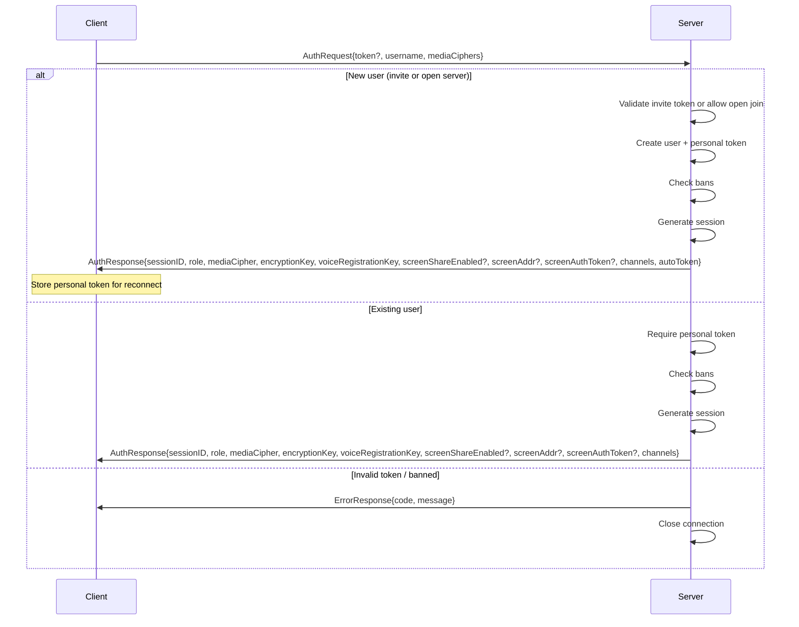
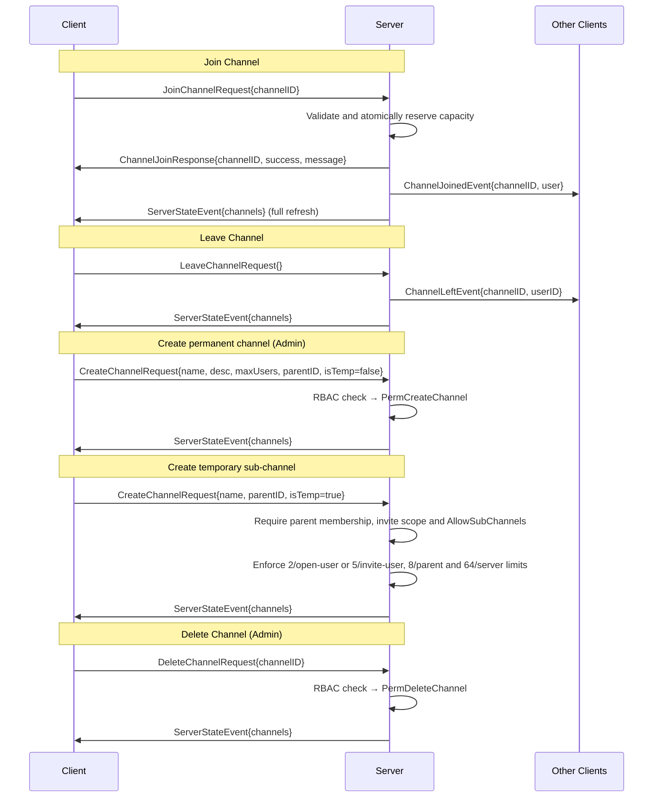
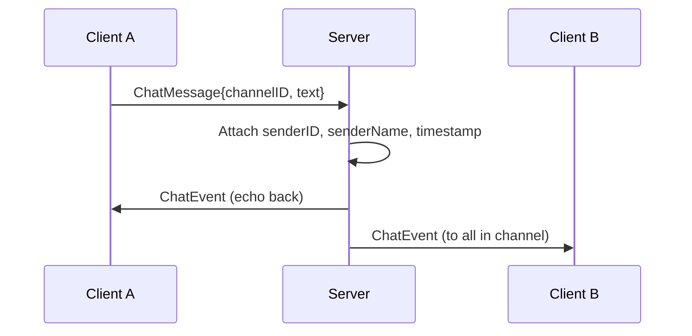

# GoSpeak Protocol

GoSpeak uses three transport layers: a **TCP/TLS 1.3 control plane** for signalling, a **UDP voice plane** for real-time audio, and a **TCP/TLS screen plane** for low-rate screen-share media.

## Control Plane (TCP/TLS)

- **Port**: 9600 (default)
- **Transport**: TCP with TLS 1.3 (self-signed certificates auto-generated on first run)
- **Framing**: Length-prefixed JSON. Each message is preceded by a 4-byte big-endian uint32 length header.
- **Serialization**: JSON with `omitempty`. Only the populated field in `ControlMessage` is serialized.

### Message Envelope
Every control message is a `ControlMessage` struct with exactly one field set. Writers reject empty envelopes, envelopes with multiple populated fields, and `null` message values. Readers additionally reject repeated top-level fields (including escaped equivalents), unknown top-level fields, and malformed or trailing JSON. Unknown fields are rejected deliberately: peers using a protocol version newer than the reader's must not send message types the reader does not know.

- `AuthRequest`
- `AuthResponse`
- `ChannelListRequest`
- `ChannelListResponse`
- `JoinChannelRequest`
- `ChannelJoinResponse`
- `LeaveChannelRequest`
- `ChannelJoinedEvent`
- `ChannelLeftEvent`
- `UserStateUpdate`
- `ServerStateEvent`
- `CreateChannelRequest`
- `DeleteChannelRequest`
- `CreateTokenRequest`
- `CreateTokenResponse`
- `KickUserRequest`
- `BanUserRequest`
- `ListBansRequest`
- `ListBansResponse`
- `UnbanRequest`
- `UnbanResponse`
- `ChatMessage`
- `ChatEvent`
- `ScreenShareStartRequest`
- `ScreenShareStopRequest`
- `ScreenShareSubscribeRequest`
- `ScreenShareShareRequest`
- `ScreenShareUnsubscribeRequest`
- `ScreenShareEvent`
- `SetUserRoleRequest`
- `SetUserRoleResponse`
- `ExportDataRequest`
- `ExportDataResponse`
- `ImportChannelsRequest`
- `ImportChannelsResponse`
- `ErrorResponse`
- `Ping` / `Pong`

### Wire Format

```
┌──────────────────────────────────────────┐
│  4 bytes: message length (big-endian)    │
├──────────────────────────────────────────┤
│  N bytes: JSON-encoded ControlMessage    │
└──────────────────────────────────────────┘
```

### Authentication Flow


```mermaid
sequenceDiagram
    participant C as Client
    participant S as Server

    C->>S: AuthRequest{token?, username, mediaCiphers}
    alt New user (invite or open server)
        S->>S: Validate invite token or allow open join
        S->>S: Create user + personal token
        S->>S: Check bans
        S->>S: Generate session
        S->>C: AuthResponse{sessionID, role, mediaCipher, encryptionKey, voiceRegistrationKey, screenShareEnabled?, screenAddr?, screenAuthToken?, channels, autoToken}
        Note over C: Store personal token for reconnect
    else Existing user
        S->>S: Require personal token
        S->>S: Check bans
        S->>S: Generate session
        S->>C: AuthResponse{sessionID, role, mediaCipher, encryptionKey, voiceRegistrationKey, screenShareEnabled?, screenAddr?, screenAuthToken?, channels}
    else Invalid token / banned
        S->>C: ErrorResponse{code, message}
        S->>S: Close connection
    end
```

### Channel Operations


```mermaid
sequenceDiagram
    participant C as Client
    participant S as Server
    participant Others as Other Clients

    Note over C,S: Join Channel
    C->>S: JoinChannelRequest{channelID}
    S->>S: Validate and atomically reserve capacity
    S->>C: ChannelJoinResponse{channelID, success, message}
    S->>Others: ChannelJoinedEvent{channelID, user}
    S->>C: ServerStateEvent{channels} (full refresh)

    Note over C,S: Leave Channel
    C->>S: LeaveChannelRequest{}
    S->>Others: ChannelLeftEvent{channelID, userID}
    S->>C: ServerStateEvent{channels}

    Note over C,S: Create permanent channel (Admin)
    C->>S: CreateChannelRequest{name, desc, maxUsers, parentID, isTemp=false}
    S->>S: RBAC check → PermCreateChannel
    S->>C: ServerStateEvent{channels}

    Note over C,S: Create temporary sub-channel
    C->>S: CreateChannelRequest{name, parentID, isTemp=true}
    S->>S: Require parent membership, invite scope and AllowSubChannels
    S->>S: Enforce 2/open-user or 5/invite-user, 8/parent and 64/server limits
    S->>C: ServerStateEvent{channels}

    Note over C,S: Delete Channel (Admin)
    C->>S: DeleteChannelRequest{channelID}
    S->>S: RBAC check → PermDeleteChannel
    S->>C: ServerStateEvent{channels}
```

Temporary sub-channels are removed five minutes after becoming empty. Occupied temporary channels remain available, while deleting a parent makes its temporary children eligible for removal. Open servers allow two temporary channels per user; invite-only servers allow five.

### Chat


```mermaid
sequenceDiagram
    participant A as Client A
    participant S as Server
    participant B as Client B

    A->>S: ChatMessage{channelID, text}
    S->>S: Attach senderID, senderName, timestamp
    S->>A: ChatEvent (echo back)
    S->>B: ChatEvent (to all in channel)
```

### Screen Sharing Signalling

The control plane carries screen-share lifecycle messages only:

- `ScreenShareStartRequest`
- `ScreenShareStopRequest`
- `ScreenShareSubscribeRequest`
- `ScreenShareShareRequest`
- `ScreenShareUnsubscribeRequest`
- `ScreenShareEvent`

`ScreenShareEvent` is broadcast to channel members for presence updates. Active events carry `media_cipher`. A targeted copy with an `encryption_key` is sent to the active sharer, to users already in the channel when sharing starts, and to current channel members if the sharer later shares the active key with the channel again. The client disconnects if the active event's suite differs from the authenticated choice.

### Admin Operations

| Message | Direction | Description |
|---------|-----------|-------------|
| `CreateTokenRequest` | Client → Server | Generate invite token with role, scope, max uses, expiry |
| `CreateTokenResponse` | Server → Client | Returns raw token string |
| `KickUserRequest` | Client → Server | Kick user by ID with reason |
| `BanUserRequest` | Client → Server | Ban user with optional duration |
| `ListBansRequest` | Client → Server | Read a bounded page of active account and exact-address bans |
| `ListBansResponse` | Server → Client | Ban page and continuation indicator |
| `UnbanRequest` | Client → Server | Remove one ban by ID |
| `UnbanResponse` | Server → Client | Confirms whether the ban was removed |
| `SetUserRoleRequest` | Client → Server | Promote/demote user (admin only) |
| `SetUserRoleResponse` | Server → Client | Success/failure message |
| `ExportDataRequest` | Client → Server | Export channels or users as YAML |
| `ExportDataResponse` | Server → Client | YAML string data |
| `ImportChannelsRequest` | Client → Server | Import channels from YAML |
| `ImportChannelsResponse` | Server → Client | Success/failure message |

---

## Voice Plane (UDP)

- **Port**: 9601 (default)
- **Transport**: Raw UDP
- **Encryption**: AES-128-GCM (default), AES-256-GCM, or ChaCha20-Poly1305 (shared key and explicit suite distributed in `AuthResponse` over TLS)
- **Codec**: Opus at 48 kHz mono, 20ms frames (960 samples)

### Authenticated Endpoint Registration

A voice endpoint is not learned from an ordinary voice packet. During control authentication, the server creates a random 32-byte `voice_registration_key` for that session and returns it inside the TLS-protected `AuthResponse`. The client immediately sends this registration datagram and refreshes it every five seconds:

```
[Magic "GSR1":4B][SessionID:4B][Counter:8B][HMAC-SHA-256:32B]
```

The HMAC covers the first 16 bytes. The server accepts only a valid proof for the named active session with a counter greater than every previously accepted counter. Once a registration is accepted, the same datagram cannot be replayed. A source-address change requires a fresh proof and is accepted at most once per five seconds; this permits controlled NAT rebinding without STUN or TURN. Voice packets from unregistered or mismatched endpoints are dropped.

This field is required: clients and servers from before authenticated UDP registration are not voice-compatible with this protocol revision and fail closed rather than falling back to first-packet binding.

### Packet Format

```
┌─────────────────────────────────────────────────────────┐
│  Header (20 bytes, sent as plaintext additional data)   │
│  ┌───────────────┬─────────────┬──────────────┬────────┐ │
│  │SessionID (4B) │SeqNum (4B)  │Timestamp (4B)│Chan(8B)│ │
│  └───────────────┴─────────────┴──────────────┴────────┘ │
├─────────────────────────────────────────────────────────┤
│  Payload: selected AEAD(opus_frame)                     │
│  ┌──────────────────────────────────────────────┐       │
│  │ Ciphertext (variable) + Auth Tag (16 bytes)  │       │
│  └──────────────────────────────────────────────┘       │
└─────────────────────────────────────────────────────────┘
```

The 64-bit unsigned channel field carries positive SQLite channel IDs without
truncation. The 20-byte header is authenticated as AEAD additional data.
Clients and servers using the former 14-byte voice header are not wire-compatible.

### Voice Pipeline


```mermaid
graph LR
    subgraph "Client A (Sender)"
        MIC[Microphone<br/>PortAudio] --> PCM[PCM 48kHz<br/>16-bit mono]
        PCM --> VAD{VAD<br/>Check}
        VAD -->|Active| ENC[Opus<br/>Encoder]
        VAD -->|Silent| DROP[Drop]
        ENC --> ENCRYPT[Selected AEAD<br/>Encrypt]
        ENCRYPT --> UDP_OUT[UDP Send]
    end

    UDP_OUT --> SFU

    subgraph Server
        SFU[SFU<br/>Relay to<br/>channel members]
    end

    SFU --> UDP_IN

    subgraph "Client B (Receiver)"
        UDP_IN[UDP Recv] --> DECRYPT[Selected AEAD<br/>Decrypt]
        DECRYPT --> JITTER[Jitter<br/>Buffer]
        JITTER --> DEC[Opus<br/>Decoder]
        DEC --> SPK[Speaker<br/>PortAudio]
    end
```

### SFU Relay Logic

The server does **not** decode Opus audio. It:

1. Receives a UDP packet from a client
2. Parses the 20-byte plaintext header and verifies the registered source endpoint and current channel
3. Opens the selected AEAD payload transiently to authenticate the ciphertext and complete header; it does not decode, log, or retain the Opus plaintext
4. Applies a per-session 64-packet replay window after authentication
5. Forwards the original ciphertext **as-is** to all other members of that channel
6. Skips the sender (no echo) and any deafened users

### Nonce Construction

The selected AEAD nonce (12 bytes) is deterministic and never reused while a voice key is active:

```
Nonce = [SessionID (4B)] [SeqNum (4B)] [0x00 0x00 0x00 0x00 (4B)]
```

- `SessionID` is allocated from a random starting point and is never issued again during the server lifecycle, even after its session disconnects
- the shared voice key is generated for that same server lifecycle, so historical sessions cannot repeat a nonce under the same key
- `SeqNum` starts at one and increases monotonically per sender; the client refuses to send after `uint32` exhaustion and requires a reconnect instead of wrapping to zero

Nonce uniqueness and replay rejection are separate properties. After AEAD
authentication, the server accepts each positive sequence number once within a
64-packet sliding window. An unseen authenticated packet up to 63 positions behind
the high-water mark is accepted once to tolerate UDP reordering. Duplicates,
sequence zero, wrapped sequences, and packets at least 64 positions behind the
high-water mark are rejected. Replay state lives until the control session ends,
so jitter-buffer cleanup does not reopen the window.

---

## Screen Plane (TCP/TLS)

- **Port**: 9603 (default)
- **Transport**: Dedicated TCP/TLS connection per authenticated session
- **Authentication**: Ephemeral `screen_auth_token` issued in `AuthResponse`
- **Encryption**: The selected media AEAD with one key per active screen share
- **Usage**: Low-rate JPEG frames, forwarded only to subscribed viewers

### Connection Flow

1. Client authenticates on the control plane.
2. When screen sharing is enabled, the server sets `screen_share_enabled` and returns `screen_addr` plus a session-scoped `screen_auth_token`. These optional fields are omitted when the feature is disabled.
3. The client opens the screen-plane TLS connection only when `screen_share_enabled` is true, then authenticates with the token.
4. Screen-share start/stop/subscribe still happen on the control plane.
5. Actual encrypted frame packets flow over the screen plane.

### Relay Logic

The server does not need to decode screen frames. It:

1. Authenticates a screen-plane connection against the existing control session.
2. Accepts encrypted packets from the active sharer only.
3. Looks up the sharer's subscribed viewers.
4. Forwards each packet as-is to those viewers.

### Packet Format

Each screen packet is length-prefixed on the TCP stream:

```
[Length:4B][SessionID:4B][SeqNum:4B][Ciphertext+AuthTag]
```

The selected AEAD authenticates the 8-byte packet header `[SessionID|SeqNum]` as additional data.
The encrypted payload contains timestamp, frame dimensions, frame format, and
frame bytes. The relay checks active-sharer authorization and pacing from the
fixed header before allocating the bounded frame body, then authenticates the AEAD tag
before committing a strictly increasing sequence. Replays and out-of-order
screen packets are rejected because this plane uses an ordered TCP stream.
`SeqNum` starts at one and continues across screen-share key changes within the
same authenticated control connection. A new key creates fresh replay state on
the server and viewers without resetting the sender's counter. The counter resets
only for a new control-connection generation, and the sender stops sharing before
it can wrap.
