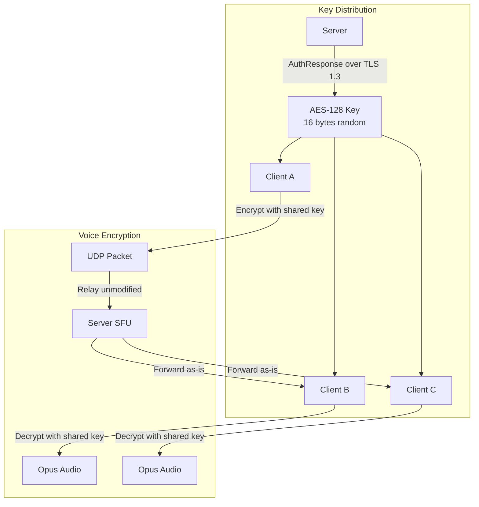
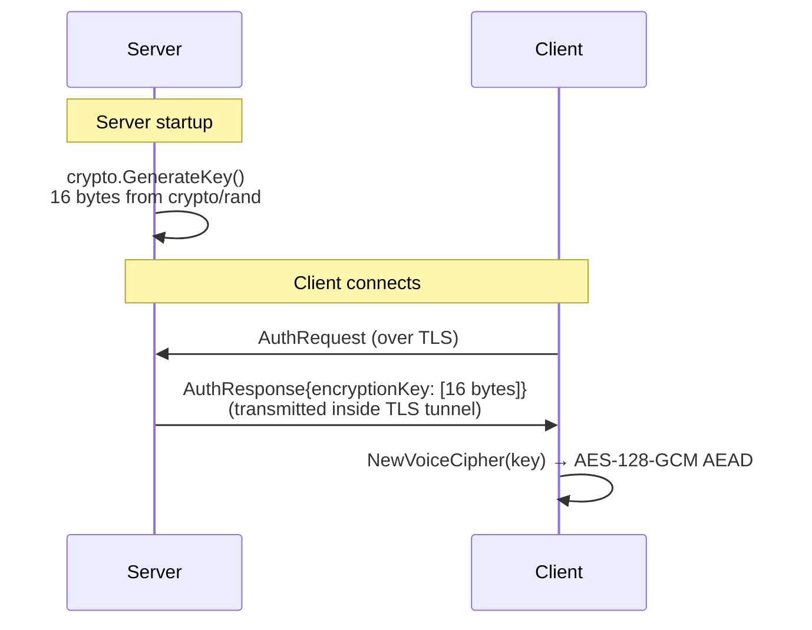
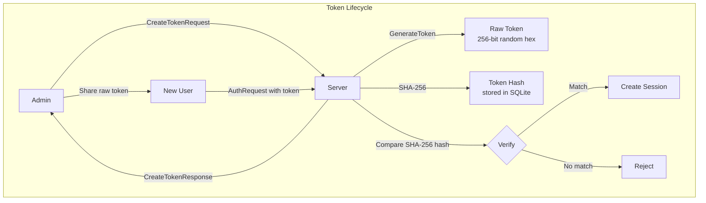
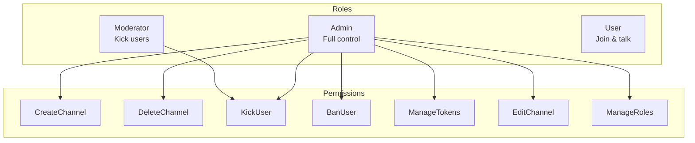

# GoSpeak Security & Encryption

GoSpeak is designed with security as a core principle. All communication is encrypted and the server operates as a relay without decoding audio.

> **Note on the shared key model:** The current design uses a single server-wide AES-128 key distributed to all clients. The server generates and holds this key, so a compromised server _could_ theoretically decrypt voice traffic. This is a known trade-off for simplicity. A future improvement could use per-pair Diffie-Hellman key exchange to achieve true end-to-end encryption where the server cannot decrypt.

## Threat Model

| Threat | Mitigation |
|--------|-----------|
| Network eavesdropping | TLS 1.3 for control plane, AES-128-GCM for voice |
| Server compromise (voice) | Server holds the shared key and _could_ decrypt — see note above. Mitigated by running your own trusted server |
| Replay attacks | Deterministic nonces from SessionID + SeqNum prevent replay |
| Unauthorized access | Token-based auth with SHA-256 hashed storage, RBAC |
| Brute force tokens | Tokens are 256-bit random (64-char hex), hashed with SHA-256 |
| Password attacks | Argon2id with hardened parameters (64MB memory, 4 iterations) |
| Privilege escalation | Server-side RBAC checks on every admin operation |

## Encryption Overview



## Control Plane Security (TLS 1.3)

- The control plane uses **TLS 1.3** (the latest version) for all TCP connections
- On first run, the server automatically generates a **self-signed ECDSA P-256 certificate**
- Certificate is valid for 1 year, with SAN for `localhost`, `127.0.0.1`, and `::1`
- Custom certificates can be provided via `-cert` and `-key` flags
- Client currently uses `InsecureSkipVerify` for self-signed certs (suitable for private deployments)

### TLS Configuration

```go
tlsCfg := &tls.Config{
    Certificates: []tls.Certificate{cert},
    MinVersion:   tls.VersionTLS13,
}
```

## Voice Encryption (AES-128-GCM)

### Key Generation



- One shared key per server session (generated at server startup)
- Key is distributed to each client during authentication, inside the encrypted TLS tunnel
- All clients in the server share the same voice key

### Encryption Process

For each voice packet:

1. **Nonce construction** (12 bytes, deterministic):
   - Bytes 0-3: `SessionID` (uint32, big-endian)
   - Bytes 4-7: `SeqNum` (uint32, big-endian)
   - Bytes 8-11: `0x00000000` (padding)

2. **Authenticated encryption**:
   - **Algorithm**: AES-128-GCM
   - **Plaintext**: Opus-encoded audio frame
   - **Additional Data (AD)**: 8-byte packet header (SessionID + SeqNum)
   - **Output**: Ciphertext + 16-byte authentication tag

3. **Packet assembly**:
   ```
   [SessionID:4B][SeqNum:4B][Ciphertext + AuthTag]
   ```

### Security Properties

| Property | How it's achieved |
|----------|------------------|
| **Confidentiality** | AES-128-GCM encryption of Opus frames |
| **Integrity** | GCM authentication tag (16 bytes) |
| **Authenticity** | Header (SessionID + SeqNum) is authenticated as additional data |
| **Anti-replay** | Monotonic sequence numbers in nonce prevent reuse |
| **Forward secrecy** | New key generated on each server restart |

## Authentication & Token System



- Tokens are 256-bit random values (64 hex characters)
- Only the SHA-256 hash is stored in the database
- Tokens can have: role assignment, channel scope, max uses, expiration
- On first server run, an admin token is automatically generated and logged

### Open Server Mode

When `AllowNoToken` is enabled, clients can connect without a token and receive the `user` role. The server auto-generates a token internally for tracking purposes.

## Role-Based Access Control (RBAC)



Every admin operation is checked server-side via `rbac.HasPermission()` before execution. The client's role is determined by the token used during authentication.

## Password Hashing

Used internally for potential future password-based auth:

- **Algorithm**: Argon2id (winner of the Password Hashing Competition)
- **Parameters**: Time=1, Memory=64MB, Threads=4, Output=32 bytes
- **Implementation**: `golang.org/x/crypto/argon2`

## Recommendations for Production

1. **Use proper TLS certificates** (e.g., Let's Encrypt) instead of self-signed
2. **Restart the server** periodically to generate fresh voice encryption keys (a new key is generated on every startup)
3. **Use strong tokens** (the default 256-bit random is good)
4. **Restrict network access** — only expose ports 9600/tcp and 9601/udp
5. **Monitor admin token usage** — the auto-generated admin token is logged at startup
