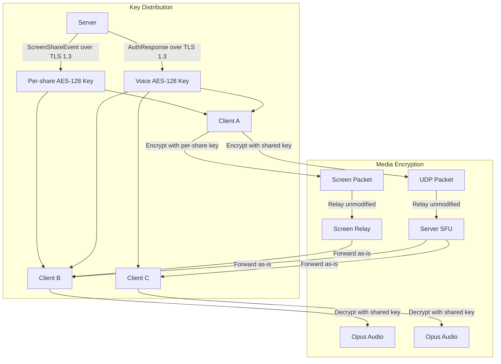
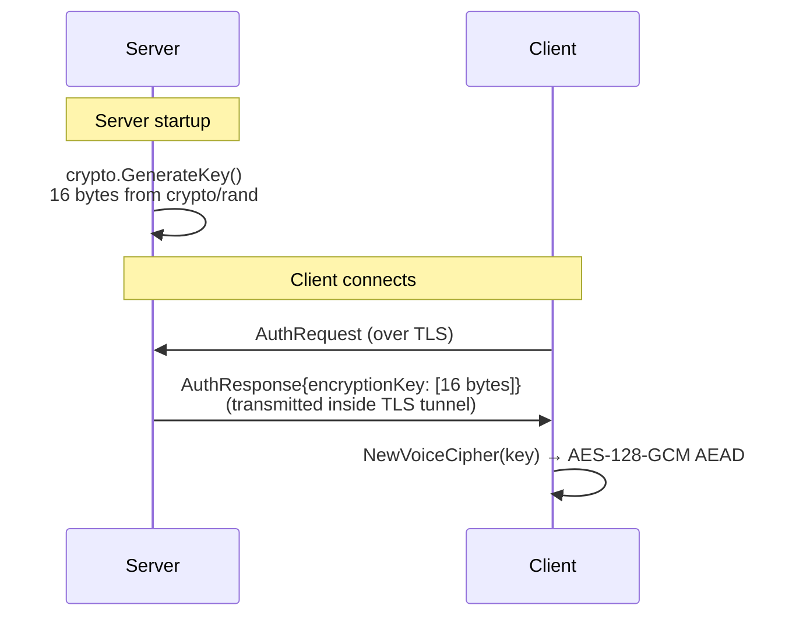
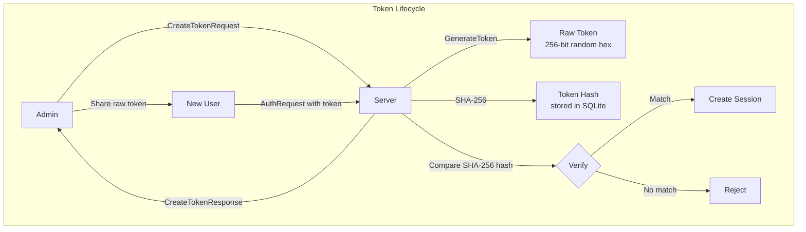
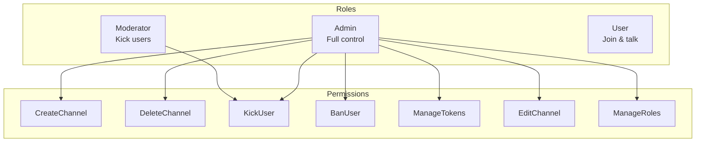

# GoSpeak Security & Encryption

GoSpeak is designed with security as a core principle. All communication is encrypted and the server operates as a relay for voice and screen-sharing media.

> **Note on the shared key model:** Voice uses a single server-wide AES-128 key distributed to all clients. Screen sharing uses a separate AES-128 key per active share, distributed to the sharer and to channel members who have been included in that share. In both cases the server generates the key material, so a compromised server _could_ theoretically decrypt media. This is a known trade-off for simplicity.

## Threat Model

| Threat | Mitigation |
|--------|-----------|
| Network eavesdropping | TLS 1.3 for control and screen planes, AES-128-GCM for voice and screen media |
| Server compromise (media) | Server holds the generated media keys and _could_ decrypt — see note above. Mitigated by running your own trusted server |
| Replay attacks | Deterministic nonces from SessionID + SeqNum prevent replay |
| Unauthorized access | Token-based auth with SHA-256 hashed storage, RBAC |
| UDP endpoint hijacking | Per-session HMAC registration proof from the TLS control channel, monotonic registration counters, and rate-limited rebinding |
| Brute force tokens | Tokens are 256-bit random (64-char hex), hashed with SHA-256 |
| Password attacks | Argon2id with hardened parameters (64MB memory, 4 iterations) |
| Privilege escalation | Server-side RBAC checks on every admin operation |

## Encryption Overview


```mermaid
graph TB
    subgraph "Key Distribution"
        SRV[Server] -->|AuthResponse over TLS 1.3| VKEY[Voice AES-128 Key]
        SRV -->|ScreenShareEvent over TLS 1.3| SKEY[Per-share AES-128 Key]
        VKEY --> CA[Client A]
        VKEY --> CB[Client B]
        VKEY --> CC[Client C]
        SKEY --> CA
        SKEY --> CB
    end

    subgraph "Media Encryption"
        CA -->|Encrypt with shared key| PKT[UDP Packet]
        PKT -->|Relay unmodified| SRV2[Server SFU]
        SRV2 -->|Forward as-is| CB
        SRV2 -->|Forward as-is| CC
        CB -->|Decrypt with shared key| AUDIO1[Opus Audio]
        CC -->|Decrypt with shared key| AUDIO2[Opus Audio]

        CA -->|Encrypt with per-share key| SCR[Screen Packet]
        SCR -->|Relay unmodified| SRV3[Screen Relay]
        SRV3 -->|Forward as-is| CB
    end
```

## Control Plane Security (TLS 1.3)

- The control plane uses **TLS 1.3** (the latest version) for all TCP connections
- On first run, the server automatically generates a **self-signed ECDSA P-256 certificate** when both `-cert` and `-key` are empty
- Certificate is valid for 1 year, with SAN for `localhost`, `127.0.0.1`, and `::1`
- Custom matching certificate/key pairs, including self-signed pairs, can be provided via `-cert` and `-key`
- Certificate handling fails closed: partial configuration, missing files, malformed PEM, mismatched keys, or damaged automatic files stop startup without overwriting existing material
- Automatically generated files are published without replacing existing paths; the private key is created with mode `0600`
- Client currently uses `InsecureSkipVerify` for self-signed certs (suitable for private deployments)

### TLS Configuration

```go
tlsCfg := &tls.Config{
    Certificates: []tls.Certificate{cert},
    MinVersion:   tls.VersionTLS13,
}
```

## Voice Encryption (AES-128-GCM)

### Key Generation


```mermaid
sequenceDiagram
    participant S as Server
    participant C as Client

    Note over S: Server startup
    S->>S: crypto.GenerateKey()<br/>16 bytes from crypto/rand

    Note over S,C: Client connects
    C->>S: AuthRequest (over TLS)
    S->>C: AuthResponse{encryptionKey: [16 bytes]}<br/>(transmitted inside TLS tunnel)
    C->>C: NewVoiceCipher(key) → AES-128-GCM AEAD
```

- One shared key per server session (generated at server startup)
- Key is distributed to each client during authentication, inside the encrypted TLS tunnel
- All clients in the server share the same voice key

### UDP Endpoint Registration

The shared media key does not authorize a UDP source address. Each control session receives a separate random 256-bit registration key in `AuthResponse`, protected by TLS. The client sends an HMAC-SHA-256 registration proof immediately and every five seconds. A monotonic 64-bit counter makes accepted proofs one-use, and the server rate-limits authenticated endpoint changes to one per five seconds. Ordinary voice packets never establish or change the endpoint.

This prevents another client from binding a victim's visible session ID to the attacker's UDP address. It does not prevent an on-path attacker from dropping UDP traffic, and it does not add NAT traversal: connectivity remains direct UDP with no STUN or TURN service.

### Encryption Process

For each voice packet:

1. **Nonce construction** (12 bytes, deterministic):
   - Bytes 0-3: `SessionID` (uint32, big-endian)
   - Bytes 4-7: `SeqNum` (uint32, big-endian)
   - Bytes 8-11: `0x00000000` (padding)

2. **Authenticated encryption**:
   - **Algorithm**: AES-128-GCM
   - **Plaintext**: Opus-encoded audio frame
   - **Additional Data (AD)**: 8-byte packet header (SessionID + SeqNum)
   - **Output**: Ciphertext + 16-byte authentication tag

3. **Packet assembly**:
   ```
   [SessionID:4B][SeqNum:4B][Ciphertext + AuthTag]
   ```

### Security Properties

| Property | How it's achieved |
|----------|------------------|
| **Confidentiality** | AES-128-GCM encryption of Opus frames |
| **Integrity** | GCM authentication tag (16 bytes) |
| **Authenticity** | Header (SessionID + SeqNum) is authenticated as additional data |
| **Anti-replay** | Monotonic sequence numbers in nonce prevent reuse |
| **Forward secrecy** | New key generated on each server restart |

## Screen Share Encryption (AES-128-GCM)

- One AES-128 key is generated for each active screen share.
- The key is delivered over the TLS control plane to the sharer and to users already in the channel when the share starts.
- If additional users join later, the sharer can share the active key with the current channel members again in one action.
- Encrypted screen packets travel on the dedicated screen TLS connection.
- The server forwards opaque encrypted packets to subscribed viewers without decoding frame contents.

Screen packet nonces follow the same deterministic pattern as voice, using the sharer's `SessionID` and a monotonically increasing screen packet sequence number.

## Authentication & Token System


```mermaid
graph TB
    subgraph "Token Lifecycle"
        ADMIN[Admin] -->|CreateTokenRequest| SRV[Server]
        SRV -->|GenerateToken| RAW[Raw Token<br/>256-bit random hex]
        SRV -->|SHA-256| HASH[Token Hash<br/>stored in SQLite]
        SRV -->|CreateTokenResponse| ADMIN
        ADMIN -->|Share raw token| USER[New User]
        USER -->|AuthRequest with token| SRV
        SRV -->|Compare SHA-256 hash| VERIFY{Verify}
        VERIFY -->|Match| SESSION[Create Session]
        VERIFY -->|No match| REJECT[Reject]
    end
```

- Tokens are 256-bit random values (64 hex characters)
- Only the SHA-256 hash is stored in the database (invite + personal tokens). Personal tokens are stored on the user record and are shown only once.
- Invite tokens can have: role assignment, channel scope, max uses, expiration. A non-zero channel scope is enforced by the server: the client auto-joins that channel and cannot join another channel. The generated personal token retains this restriction on later logins. Existing users and unscoped tokens remain server-wide. Older clients remain wire-compatible but must be upgraded to select the scoped channel automatically.
- On first server run, an admin token is automatically generated and logged

### Open Server Mode

When `AllowNoToken` is enabled, clients can connect without an invite token and receive the `user` role. The server issues a **personal token** on first login; that personal token is required for future logins with the same username.

## Role-Based Access Control (RBAC)


```mermaid
graph TB
    subgraph Roles
        ADMIN[Admin<br/>Full control]
        MOD[Moderator<br/>Kick users]
        USER[User<br/>Join & talk]
    end

    subgraph Permissions
        P1[CreateChannel]
        P2[DeleteChannel]
        P3[KickUser]
        P4[BanUser]
        P5[ManageTokens]
        P6[EditChannel]
        P7[ManageRoles]
    end

    ADMIN --> P1
    ADMIN --> P2
    ADMIN --> P3
    ADMIN --> P4
    ADMIN --> P5
    ADMIN --> P6
    ADMIN --> P7
    MOD --> P3
```

Every admin operation is checked server-side via `rbac.HasPermission()` before execution. The client's role is determined by the stored user role, and logins require the user's personal token.

## Password Hashing

Used internally for potential future password-based auth:

- **Algorithm**: Argon2id (winner of the Password Hashing Competition)
- **Parameters**: Time=1, Memory=64MB, Threads=4, Output=32 bytes
- **Implementation**: `golang.org/x/crypto/argon2`

## Recommendations for Production

1. **Use proper TLS certificates** (e.g., Let's Encrypt) instead of self-signed
2. **Restart the server** periodically to generate fresh voice encryption keys (a new key is generated on every startup)
3. **Use strong tokens** (the default 256-bit random is good)
4. **Restrict network access** — only expose ports 9600/tcp, 9601/udp, and 9603/tcp when screen sharing is enabled
5. **Monitor admin token usage** — the auto-generated admin token is logged at startup
