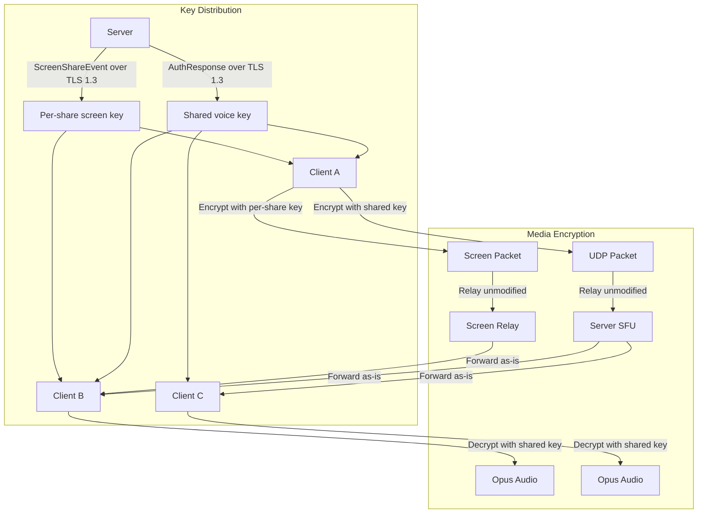
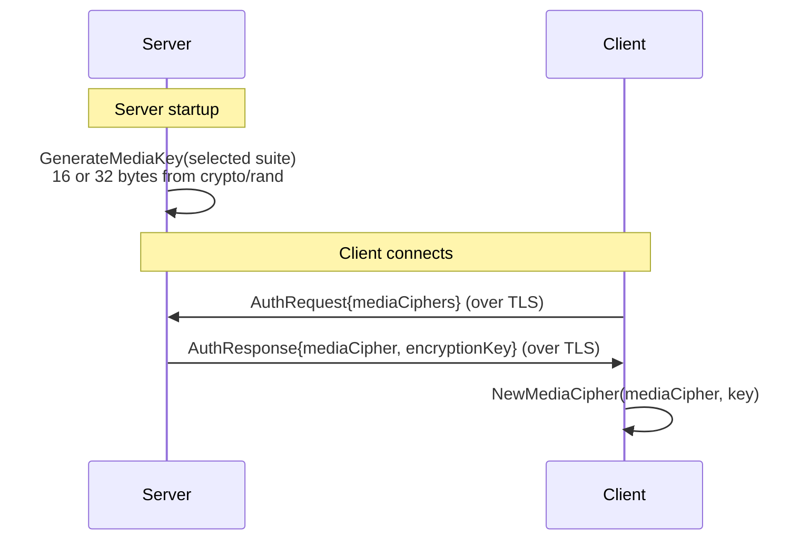
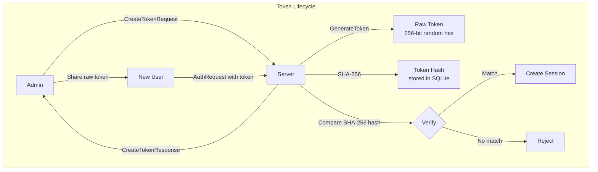
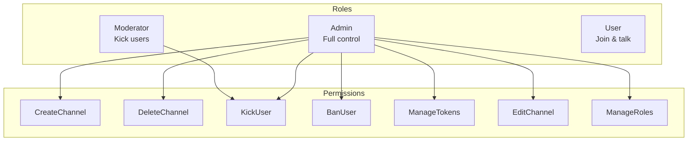

# GoSpeak Security & Encryption

GoSpeak encrypts the control, voice, and screen planes. The optional metrics and
health endpoint is plaintext, unauthenticated HTTP, so it is disabled by default
and must be restricted separately when enabled.

> **Note on the shared key model:** Voice uses one server-wide media key distributed to all clients. Screen sharing uses a separate key per active share, distributed to the sharer and authorized channel members. The server generates both keys and can decrypt media if compromised.

## Threat Model

| Threat | Mitigation |
|--------|-----------|
| Network eavesdropping | TLS 1.3 for control and screen planes; AES-128-GCM, AES-256-GCM, or ChaCha20-Poly1305 for voice and screen media |
| Active network MITM | System-PKI hostname verification or an explicitly confirmed TOFU public-key pin, shared by control and screen connections |
| Server compromise (media) | The server holds the generated media keys and can decrypt them; see the note above. Run your own trusted server to reduce this risk. |
| AEAD nonce reuse | Session IDs are never reissued while a voice key is active; voice and screen senders fail closed before sequence-number wrap |
| Media replay | Voice uses an authenticated 64-packet sliding window per control session; screen uses a strict authenticated sequence on its ordered stream |
| Unauthorized access | Token-based auth with SHA-256 hashed storage, RBAC |
| UDP endpoint hijacking | Per-session HMAC registration proof from the TLS control channel, monotonic registration counters, and rate-limited rebinding |
| Brute force tokens | Tokens are 256-bit random (64-char hex), hashed with SHA-256 |
| Password attacks | Password authentication is not implemented; a dormant Argon2id helper uses Time=1, Memory=64 MiB, and Threads=4 |
| Privilege escalation | Server-side RBAC checks on every admin operation |

## Encryption Overview


```mermaid
graph TB
    subgraph "Key Distribution"
        SRV[Server] -->|AuthResponse over TLS 1.3| VKEY[Shared voice key]
        SRV -->|ScreenShareEvent over TLS 1.3| SKEY[Per-share screen key]
        VKEY --> CA[Client A]
        VKEY --> CB[Client B]
        VKEY --> CC[Client C]
        SKEY --> CA
        SKEY --> CB
    end

    subgraph "Media Encryption"
        CA -->|Encrypt with shared key| PKT[UDP Packet]
        PKT -->|Relay unmodified| SRV2[Server SFU]
        SRV2 -->|Forward as-is| CB
        SRV2 -->|Forward as-is| CC
        CB -->|Decrypt with shared key| AUDIO1[Opus Audio]
        CC -->|Decrypt with shared key| AUDIO2[Opus Audio]

        CA -->|Encrypt with per-share key| SCR[Screen Packet]
        SCR -->|Relay unmodified| SRV3[Screen Relay]
        SRV3 -->|Forward as-is| CB
    end
```

## Control Plane Security (TLS 1.3)

- The control plane uses **TLS 1.3** (the latest version) for all TCP connections
- On first run, the server automatically generates a **self-signed ECDSA P-256 certificate** when both `-cert` and `-key` are empty
- The automatic certificate is valid for 1 year, with SAN for `localhost`, `127.0.0.1`, and `::1`
- The first new TLS connection within 30 days of expiry renews it, even if the server has stayed up continuously. Renewal keeps the existing private key, so saved TOFU fingerprints remain valid. If renewal fails while the cached certificate is still valid, GoSpeak serves that certificate and retries on a later connection; it fails closed after expiry
- Files at the automatic paths must contain GoSpeak's self-signed ECDSA P-256 material. Configure CA-issued, RSA, or otherwise operator-managed pairs explicitly with `-cert` and `-key`
- Custom matching certificate/key pairs, including self-signed pairs, can be provided via `-cert` and `-key`
- Certificate handling fails closed: partial configuration, missing files, malformed PEM, mismatched keys, expired or not-yet-valid custom certificates, and damaged or foreign automatic files stop startup without overwriting existing material
- Initial automatic files are published without replacing existing paths; the private key is created with mode `0600`. Renewal syncs a same-directory temporary certificate before replacing only `server.crt` and leaves `server.key` unchanged. Unix uses an atomic rename plus directory sync; Windows uses `MoveFileEx` with replace-existing and write-through flags
- Clients first try normal system-PKI and hostname verification. A certificate that is not publicly trusted is rejected until the user verifies and explicitly accepts its SHA-256 SubjectPublicKeyInfo fingerprint
- Accepted TOFU pins are stored by normalized control address in the bookmark file. Subsequent control connections require the same public key; screen connections require the exact identity established by the control connection
- Client settings and token-bearing bookmarks are read and replaced only through single-link files owned by the current user. GoSpeak rejects symlinks and reparse points throughout current and legacy paths, tightens Unix files to `0600`, and applies current-user-only Windows ACLs before reading. Legacy files remain usable in place until the user explicitly approves migration. Confirmed migration copies the exact validated bytes, never clobbers differing current configuration, revalidates the source before cleanup, and removes each legacy file only after securely publishing an equivalent protected replacement. If safe deletion is unavailable, migration reports the cleanup error and keeps the legacy path
- A changed TOFU pin is treated as a possible MITM and blocks the connection. Replacing it requires an explicit re-trust confirmation that displays both fingerprints

### TLS Configuration

```go
tlsCfg := &tls.Config{
    Certificates: []tls.Certificate{cert},
    MinVersion:   tls.VersionTLS13,
}
```

The client uses `VerifyConnection` as the mandatory verification path. Public certificates are checked against the operating-system roots and requested hostname. For a saved self-signed server, the callback compares the peer's SHA-256 SPKI fingerprint to the stored pin and also rejects certificates outside their validity period. `InsecureSkipVerify` is set only to delegate the built-in verification to that non-optional callback; it never means unconditional acceptance.

### Self-Signed Upgrade and Recovery

Existing bookmarks load without a pin and therefore prompt on their first connection after upgrading. Compare the displayed fingerprint with a value obtained directly from the server operator before accepting it. If a server certificate or key is intentionally replaced, the next connection fails with an identity-change warning. Verify the new fingerprint independently before using the explicit re-trust action. Do not re-trust an unexpected change merely to restore connectivity.

## Voice encryption

### Key Generation


```mermaid
sequenceDiagram
    participant S as Server
    participant C as Client

    Note over S: Server startup
    S->>S: GenerateMediaKey(selected suite)<br/>16 or 32 bytes from crypto/rand

    Note over S,C: Client connects
    C->>S: AuthRequest{mediaCiphers} (over TLS)
    S->>C: AuthResponse{mediaCipher, encryptionKey} (over TLS)
    C->>C: NewMediaCipher(mediaCipher, key)
```

- One shared voice key per server process (generated at startup)
- Key is distributed to each client during authentication, inside the encrypted TLS tunnel
- All clients in the server share the same voice key
- The server selects `-media-cipher aes128|aes256|chacha20` (`aes128` by default). It rejects clients that do not advertise the selected suite. The client checks the TLS-authenticated response's explicit suite and key length before opening media connections. Missing or unknown suites fail closed; older clients and servers must upgrade together.

### UDP Endpoint Registration

The shared media key does not authorize a UDP source address. Each control session receives a separate random 256-bit registration key in `AuthResponse`, protected by TLS. The client sends an HMAC-SHA-256 registration proof immediately and every five seconds. A monotonic 64-bit counter makes accepted proofs one-use, and the server rate-limits authenticated endpoint changes to one per five seconds. Ordinary voice packets never establish or change the endpoint.

This prevents another client from binding a victim's visible session ID to the attacker's UDP address. It does not prevent an on-path attacker from dropping UDP traffic, and it does not add NAT traversal: connectivity remains direct UDP with no STUN or TURN service.

### Encryption Process

For each voice packet:

1. **Nonce construction** (12 bytes, deterministic):
   - Bytes 0-3: `SessionID` (uint32, big-endian)
   - Bytes 4-7: `SeqNum` (uint32, big-endian)
   - Bytes 8-11: `0x00000000` (padding)

   Session IDs are allocated without reuse for the lifetime of the shared voice key, including after disconnect. Sequence numbers start at one and may not wrap; an exhausted sender must reconnect before sending more voice data.

2. **Authenticated encryption**:
   - **Algorithm**: AES-128-GCM, AES-256-GCM, or ChaCha20-Poly1305, as selected by the server
   - **Plaintext**: Opus-encoded audio frame
   - **Additional Data (AD)**: 20-byte packet header (SessionID + SeqNum + Timestamp + ChannelID)
   - **Output**: Ciphertext + 16-byte authentication tag

3. **Packet assembly**:
   ```
   [SessionID:4B][SeqNum:4B][Timestamp:4B][ChannelID:8B][Ciphertext + AuthTag]
   ```

### Security Properties

| Property | How it's achieved |
|----------|------------------|
| **Confidentiality** | Selected AEAD encrypts Opus frames |
| **Integrity** | 16-byte AEAD authentication tag |
| **Header integrity** | The complete 20-byte voice header is authenticated as additional data; the server checks the claimed sender against the registered endpoint, but the server-wide key is not cryptographic proof of one client to another |
| **Nonce uniqueness** | Session IDs are not reissued under the same key, and sequence wrap fails closed |
| **Replay rejection** | The server authenticates first, then records the sequence in a 64-packet sliding window bound to the control session |
| **Key rotation** | A new shared voice key is generated on server restart; this is lifecycle separation, not forward secrecy |

## Screen share encryption

- One key for the selected media cipher is generated for each active screen share. Active events carry the suite; clients disconnect on a missing or mismatched choice or invalid key.
- The key is delivered over the TLS control plane to the sharer and to users already in the channel when the share starts.
- If additional users join later, the sharer can share the active key with the current channel members again in one action.
- Encrypted screen packets travel on the dedicated screen TLS connection.
- The server transiently authenticates and opens each packet, then forwards the original authenticated ciphertext to subscribed viewers without parsing, decoding, logging, or retaining frame plaintext.

Screen packet nonces follow the same deterministic pattern as voice, using the sharer's `SessionID` and a sequence number that continues across key changes within one authenticated control connection. A new key creates fresh replay state on the server and viewers, but does not reset the sender's counter. The counter resets only for a new control-connection generation, and sharing stops before it can wrap. The ordered relay authenticates a frame before committing its strictly increasing sequence, so duplicate and out-of-order frames are rejected without letting forged high sequences poison the state.

## Authentication & Token System


```mermaid
graph TB
    subgraph "Token Lifecycle"
        ADMIN[Admin] -->|CreateTokenRequest| SRV[Server]
        SRV -->|GenerateToken| RAW[Raw Token<br/>256-bit random hex]
        SRV -->|SHA-256| HASH[Token Hash<br/>stored in SQLite]
        SRV -->|CreateTokenResponse| ADMIN
        ADMIN -->|Share raw token| USER[New User]
        USER -->|AuthRequest with token| SRV
        SRV -->|Compare SHA-256 hash| VERIFY{Verify}
        VERIFY -->|Match| SESSION[Create Session]
        VERIFY -->|No match| REJECT[Reject]
    end
```

- Tokens are 256-bit random values (64 hex characters)
- Only the SHA-256 hash is stored in the database (invite + personal tokens). Personal tokens are stored on the user record and are shown only once.
- Saved client bookmarks contain personal tokens in plaintext so the client can reconnect. The bookmark file is atomically written with mode `0600` under the operating system's user config directory (`gospeak/`). When legacy bookmark or settings files are found beside the executable, the client asks before migrating them. Choosing No keeps those files as the active persistence destinations. After confirmation, each original is removed only after its exact bytes are validated and published successfully; conflicting or concurrently changed files are preserved for manual resolution. Protect the user account and its config directory accordingly.
- Invite tokens can have: role assignment, channel scope, max uses, expiration. A non-zero channel scope is enforced by the server: the client auto-joins that channel and cannot join another channel. The generated personal token retains this restriction on later logins. Existing users and unscoped tokens remain server-wide.
- Redeeming an invite, creating its user, and storing the new personal-token hash happen in one database transaction. A failed user creation therefore does not consume an invite use. Credential failures use the same external error response, while detailed causes remain in server logs.
- New non-bootstrap accounts are limited to 120 successful provisions per source IP per hour. Failed attempts release their provisioning reservation but remain subject to the separate authentication-failure limit. This bound also applies in open-server mode and does not disable tokenless first login.
- On first server run, an admin bootstrap credential is written atomically to
  `bootstrap-admin.token` in the configured data directory. It is protected by
  mode `0600` and owner checks on POSIX, or a protected owner-only ACL on
  Windows, and is read without following the final symlink/reparse component.
  Provisioning is transactional and retryable for one administrator, including
  after response-delivery failures. The server invalidates the credential and
  removes its file after that administrator proves possession of the returned
  personal token. Normal logs contain only the credential path.

### Open Server Mode

When `AllowNoToken` is enabled, clients can connect without an invite token and receive the `user` role. The server issues a **personal token** on first login; that personal token is required for future logins with the same username.

## Role-Based Access Control (RBAC)


```mermaid
graph TB
    subgraph Roles
        ADMIN[Admin<br/>Full control]
        MOD[Moderator<br/>Kick users]
        USER[User<br/>Join & talk]
    end

    subgraph Permissions
        P1[CreateChannel]
        P2[DeleteChannel]
        P3[KickUser]
        P4[BanUser]
        P5[ManageTokens]
        P6[EditChannel]
        P7[ManageRoles]
    end

    ADMIN --> P1
    ADMIN --> P2
    ADMIN --> P3
    ADMIN --> P4
    ADMIN --> P5
    ADMIN --> P6
    ADMIN --> P7
    MOD --> P3
```

Every admin operation is checked server-side via `rbac.HasPermission()` before execution. The client's role is determined by the stored user role, and logins require the user's personal token.

### Moderation and ban privacy

- Moderators may kick ordinary users only. They cannot kick moderators or administrators and cannot create, inspect, or remove bans.
- Administrators may kick or ban ordinary users, moderators, and other administrators. Self-kick and self-ban are rejected.
- The administrator provisioned through the bootstrap credential is the remote recovery anchor: it cannot be remotely banned or demoted. Operator-local database recovery remains possible. A later exact-address ban also does not disconnect or block this account.
- An account ban is identity-only, terminates all current sessions for that account, and is synchronized with authentication so a racing reconnect cannot publish a new session. Zero duration means permanent; positive durations are capped at ten years and invalid values are rejected.
- An IP ban is a separate, explicit administrator choice tied to one selected live session. It stores one canonical exact address only; it never expands to a subnet. IPv4-mapped IPv6 addresses are normalized to IPv4.
- Exact-address bans can affect unrelated users behind a shared NAT or VPN. The client warns before creating one, and all matching non-bootstrap sessions are disconnected.
- Normal kicks and account bans never persist an IP address. Client-supplied moderation reasons are neither persisted, logged, nor echoed to affected connections; disconnect notices are generic. Runtime address use for connection handling and rate limiting remains in memory.
- Upgrading removes legacy ban reasons and clears legacy IP data that was not created through the explicit IP-ban action.
- Active account and exact-address bans can be listed in bounded cursor pages and removed only by administrators.

## Password Hashing

This helper is not called by the current token-based authentication flow. It is
available for possible future password authentication:

- **Algorithm**: Argon2id (winner of the Password Hashing Competition)
- **Parameters**: Time=1, Memory=64MB, Threads=4, Output=32 bytes
- **Implementation**: `golang.org/x/crypto/argon2`

## Recommendations for Production

1. **Use proper TLS certificates** (e.g., Let's Encrypt) instead of self-signed
2. **Restart the server** periodically to generate fresh voice encryption keys (a new key is generated on every startup)
3. **Use strong tokens** (the default 256-bit random is good)
4. **Restrict network access**. Only expose ports 9600/tcp, 9601/udp, and 9603/tcp when screen sharing is enabled.
5. **Protect bootstrap credentials**. Read `bootstrap-admin.token` only through the server administrator account and retain the returned personal token.
